# LaporRuta

> Platform pelaporan masalah fasilitas dan infrastruktur publik berbasis lokasi.

LaporRuta adalah aplikasi web yang memungkinkan masyarakat melaporkan masalah fasilitas dan infrastruktur publik dengan menyertakan lokasi, kategori, deskripsi, dan bukti gambar.

Laporan yang masuk dapat diverifikasi, diprioritaskan, ditugaskan kepada admin wilayah terkait, serta dipantau hingga statusnya terselesaikan.

LaporRuta dirancang untuk meningkatkan transparansi, partisipasi masyarakat, dan efektivitas pengelolaan laporan publik melalui sistem berbasis lokasi.

---

## Table of Contents

- [Overview](#overview)
- [Problem](#problem)
- [Solution](#solution)
- [Key Features](#key-features)
- [User Roles](#user-roles)
- [System Architecture](#system-architecture)
- [Technology Stack](#technology-stack)
- [Project Structure](#project-structure)
- [Application Preview](#application-preview)
- [Documentation](#documentation)
- [Getting Started](#getting-started)
- [Environment Variables](#environment-variables)
- [Deployment](#deployment)
- [Priority Algorithm](#priority-algorithm)
- [SDG Alignment](#sdg-alignment)
- [Future Development](#future-development)
- [Project Status](#project-status)

---

# Overview

Permasalahan fasilitas publik seperti jalan rusak, lampu jalan bermasalah, fasilitas umum yang rusak, atau masalah lingkungan sering kali membutuhkan laporan dari masyarakat sebelum dapat ditindaklanjuti.

Namun, proses pelaporan dapat menjadi kurang efektif apabila:

- lokasi masalah tidak jelas,
- laporan tersebar pada berbagai kanal,
- masyarakat tidak mengetahui perkembangan laporan,
- laporan sulit diprioritaskan,
- admin kesulitan menentukan wilayah penanganan,
- dan tidak terdapat riwayat aktivitas yang jelas.

LaporRuta menyediakan satu platform untuk menghubungkan masyarakat dengan sistem pengelolaan laporan berbasis wilayah.

### Core Flow

```text
Masyarakat
    │
    ▼
Membuat Laporan
    │
    ├── Deskripsi
    ├── Kategori
    ├── Lokasi
    └── Bukti Gambar
    │
    ▼
Moderasi
    │
    ├── Rejected
    │
    └── Verified
          │
          ▼
      Penugasan
          │
          ▼
     In Progress
          │
          ▼
       Resolved
```

---

# Problem

Masyarakat membutuhkan cara yang mudah dan transparan untuk melaporkan masalah di lingkungan mereka.

Beberapa masalah yang ingin diselesaikan LaporRuta:

### 1. Lokasi laporan tidak selalu jelas

Laporan masalah publik membutuhkan informasi lokasi yang akurat agar dapat ditindaklanjuti oleh pihak yang bertanggung jawab.

### 2. Sulit mengetahui perkembangan laporan

Setelah membuat laporan, masyarakat membutuhkan informasi mengenai status dan perkembangan laporan.

### 3. Banyak laporan sulit diprioritaskan

Admin dapat menerima banyak laporan dengan tingkat urgensi dan dukungan masyarakat yang berbeda.

### 4. Penanganan berdasarkan wilayah

Laporan perlu diarahkan kepada admin wilayah yang bertanggung jawab terhadap area tersebut.

### 5. Kurangnya transparansi aktivitas

Perubahan status dan tindakan administratif perlu dapat ditelusuri melalui activity log.

---

# Solution

LaporRuta menyediakan sistem pelaporan publik yang menggabungkan:

- Pelaporan berbasis lokasi.
- Peta interaktif.
- Geotagging.
- Moderasi laporan.
- Upvote masyarakat.
- Sistem prioritas.
- Penugasan berdasarkan wilayah.
- Status tracking.
- Komentar.
- Activity log.
- Dashboard admin.
- Real-time update.

Dengan pendekatan tersebut, masyarakat dapat berpartisipasi dalam pelaporan masalah publik sementara administrator mendapatkan sistem terstruktur untuk memproses dan memprioritaskan laporan.

---

# Key Features

## Public / User

- Register dan login.
- Logout dan refresh authentication.
- Eksplorasi peta interaktif.
- Marker clustering.
- Pemilihan lokasi bertingkat.
- Penentuan lokasi melalui mini map.
- Membuat laporan.
- Geo-tagged report.
- Upload gambar.
- Melihat laporan milik sendiri.
- Melihat detail laporan.
- Public report detail.
- Upvote laporan.
- Komentar.
- Tracking status laporan.
- Real-time public map update.

## Admin Wilayah

- Dashboard laporan wilayah.
- Moderation queue.
- Melihat laporan berdasarkan wilayah.
- Mengubah status laporan.
- Upload after image.
- Menambahkan catatan internal.
- Melihat activity log.
- Real-time dashboard update.
- Pengelolaan laporan yang ditugaskan.

## Admin Pusat

- Dashboard pusat.
- Monitoring seluruh laporan.
- Statistik laporan.
- Algoritma prioritas.
- Assignment dan fallback.
- Reassign wilayah.
- Override status.
- Edit metadata laporan.
- Export CSV.
- Toggle status admin.
- Invitation admin.
- Accept invitation.
- Monitoring activity log.

---

# User Roles

LaporRuta menggunakan Role-Based Access Control (RBAC).

| Role            | Access                                                                   |
| --------------- | ------------------------------------------------------------------------ |
| `user`          | Membuat laporan, melihat laporan, upvote, komentar, dan tracking laporan |
| `admin_wilayah` | Mengelola laporan pada wilayah yang ditugaskan                           |
| `admin_pusat`   | Mengelola dan memonitor seluruh laporan serta administrator              |

### User

Pengguna umum dapat:

- Membuat laporan.
- Melihat laporan publik.
- Memberikan upvote.
- Memberikan komentar.
- Melihat status laporan.
- Melihat detail laporan miliknya.

### Admin Wilayah

Admin wilayah bertanggung jawab terhadap laporan yang berada pada wilayah yang ditugaskan kepadanya.

### Admin Pusat

Admin pusat memiliki cakupan pengelolaan yang lebih luas dan bertanggung jawab terhadap monitoring sistem serta administrator wilayah.

---

# System Architecture

LaporRuta menggunakan arsitektur frontend-backend terpisah.

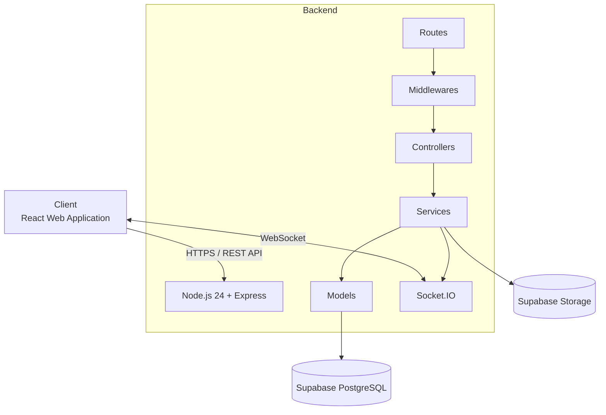

Untuk deployment submission, frontend di-host pada Netlify sedangkan backend dijalankan menggunakan Docker pada PC lokal dan diekspos melalui ngrok.

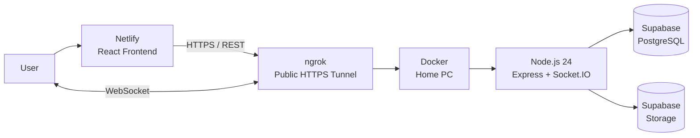

Detail arsitektur tersedia pada:

[`docs/03-architecture.md`](./docs/03-architecture.md)

Database design tersedia pada:

[`docs/04-database.md`](./docs/04-database.md)

---

# Technology Stack

## Frontend

| Technology       | Purpose                 |
| ---------------- | ----------------------- |
| React 19         | User interface          |
| Vite             | Frontend build tool     |
| React Router     | Client-side routing     |
| React Query      | Server state management |
| Leaflet          | Interactive map         |
| Socket.IO Client | Real-time communication |

## Backend

| Technology | Purpose                  |
| ---------- | ------------------------ |
| Node.js 24 | JavaScript runtime       |
| Express    | REST API framework       |
| Socket.IO  | Real-time communication  |
| PostgreSQL | Relational database      |
| Docker     | Backend containerization |

## Infrastructure

| Technology | Purpose                       |
| ---------- | ----------------------------- |
| Netlify    | Frontend hosting              |
| Supabase   | PostgreSQL and object storage |
| ngrok      | Public tunnel for backend     |
| Docker     | Backend runtime environment   |

---

# Project Structure

```text
laporruta-itechnocup2026/
│
├── README.md
│
├── docs/
│   ├── 01-prd.md
│   ├── 02-sdg.md
│   ├── 03-architecture.md
│   ├── 04-database.md
│   ├── 05-api.md
│   ├── 06-deployment.md
│   │
│   └── assets/
│       └── screenshots/
│           ├── createReport.png
│           ├── dashboardPusat.png
│           ├── dashboardPusat2.png
│           ├── dashboardPusat3.png
│           ├── dashboardPusat4.png
│           ├── dashboardUser.png
│           ├── dashboardUser2.png
│           ├── dashboardUser3.png
│           ├── dashboardWilayah.png
│           ├── detailReport.png
│           ├── detailReport2.png
│           ├── detailReportUser.png
│           ├── feed.png
│           ├── home.png
│           ├── home2.png
│           └── myReports.png
│
├── laporruta-backend/
│
└── laporruta-frontend/
```

---

# Application Preview

## Homepage

Halaman utama menyediakan akses ke peta dan laporan publik.

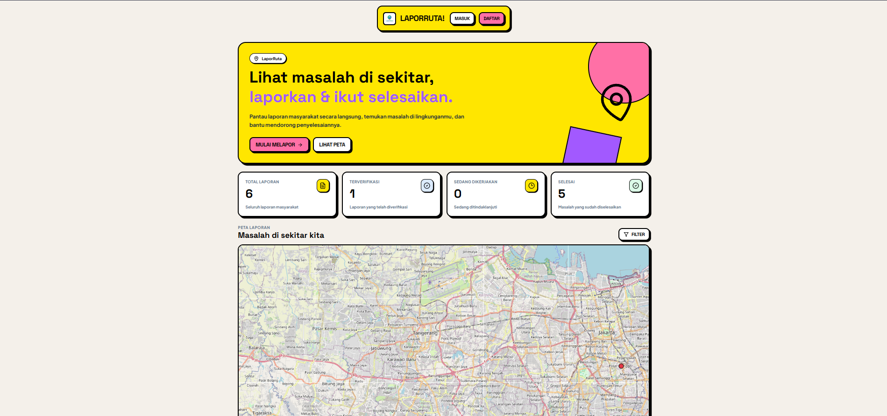

---

## Public Feed

Masyarakat dapat melihat laporan publik melalui feed.

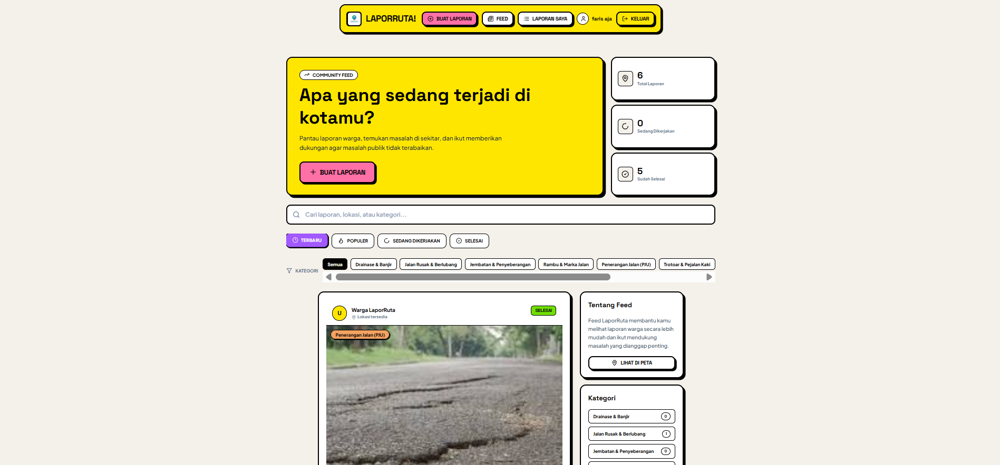

---

## Create Report

Pengguna dapat membuat laporan dengan memberikan informasi masalah, kategori, lokasi, dan bukti gambar.

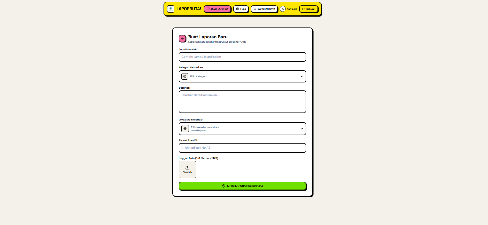

---

## My Reports

Pengguna dapat melihat laporan yang telah dibuat.

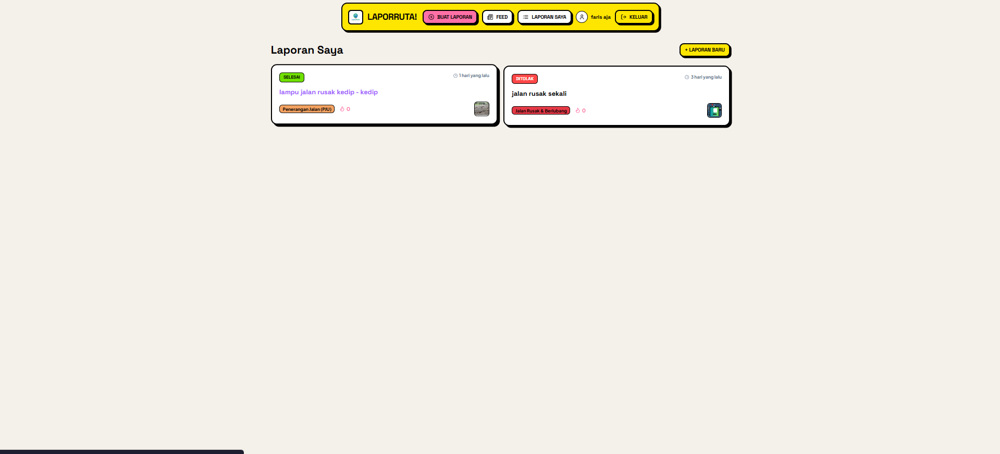

---

## Report Detail

Detail laporan menampilkan informasi lengkap mengenai laporan dan status penanganannya.

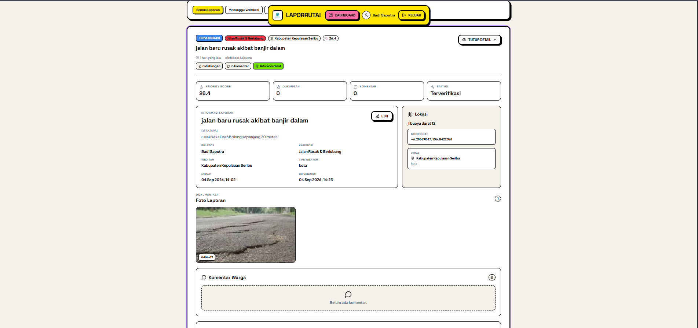

---

## User Dashboard

Dashboard pengguna menyediakan informasi terkait aktivitas dan laporan pengguna.

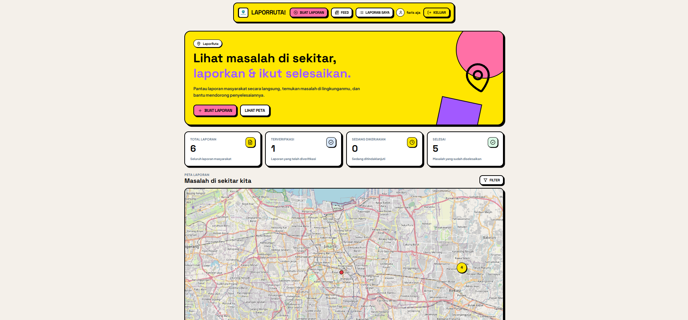

---

## Admin Wilayah Dashboard

Admin wilayah dapat memantau dan mengelola laporan berdasarkan wilayah yang menjadi tanggung jawabnya.

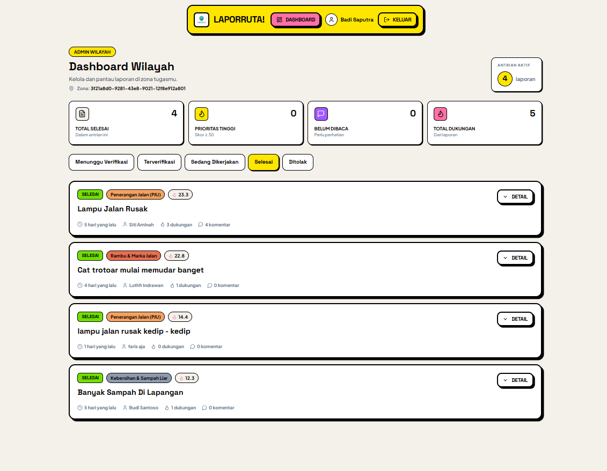

---

## Admin Pusat Dashboard

Admin pusat dapat memantau laporan secara keseluruhan melalui dashboard pusat.

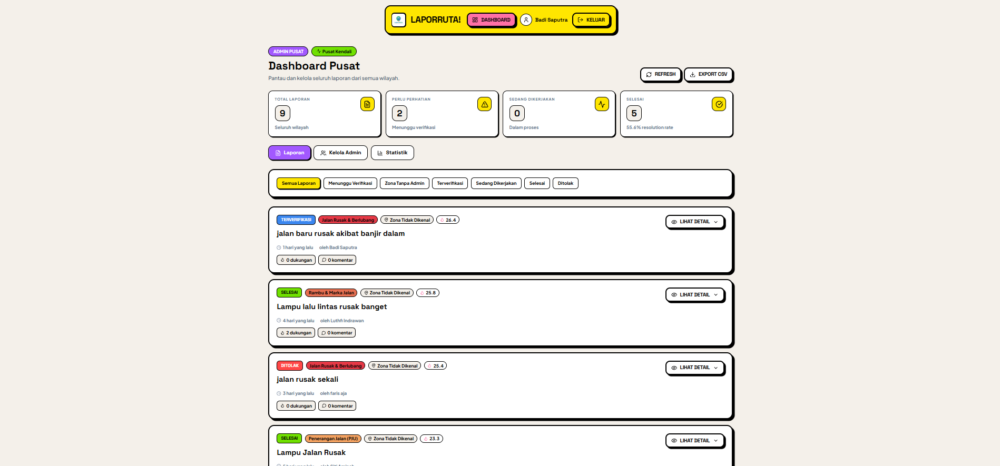

---

# Documentation

Dokumentasi teknis dan produk tersedia pada folder `docs/`.

| Document                                  | Description                                                                               |
| ----------------------------------------- | ----------------------------------------------------------------------------------------- |
| [PRD](./docs/01-prd.md)                   | Product requirements, user stories, feature scope, business rules, dan priority algorithm |
| [SDG](./docs/02-sdg.md)                   | Hubungan LaporRuta dengan Sustainable Development Goals                                   |
| [Architecture](./docs/03-architecture.md) | Arsitektur sistem, komponen, communication flow, dan deployment architecture              |
| [Database](./docs/04-database.md)         | Struktur database, tabel, relasi, dan data model                                          |
| [API Contract](./docs/05-api.md)          | API contract antara frontend dan backend                                                  |
| [Deployment](./docs/06-deployment.md)     | Panduan setup dan deployment aplikasi                                                     |

---

# Getting Started

## Requirements

Pastikan environment memiliki:

- Node.js 24
- npm
- Docker
- Git

Untuk backend deployment:

- ngrok
- Supabase project

---

# Clone Repository

```bash
git clone <repository-url>

cd laporruta-itechnocup2026
```

---

# Frontend Setup

Masuk ke folder frontend:

```bash
cd laporruta-frontend
```

Install dependencies:

```bash
npm install
```

Buat environment file:

```env
VITE_API_URL=<BACKEND_API_URL>
```

Jalankan development server:

```bash
npm run dev
```

Frontend akan tersedia pada alamat yang ditampilkan oleh Vite.

---

# Backend Setup

Masuk ke folder backend:

```bash
cd laporruta-backend
```

Install dependencies:

```bash
npm install
```

Buat file:

```text
.env
```

Isi configuration sesuai environment backend.

Contoh:

```env
NODE_ENV=development
PORT=3000

DATABASE_URL=<SUPABASE_POSTGRES_CONNECTION_STRING>

JWT_ACCESS_SECRET=<ACCESS_TOKEN_SECRET>
JWT_REFRESH_SECRET=<REFRESH_TOKEN_SECRET>

SUPABASE_URL=<SUPABASE_PROJECT_URL>
SUPABASE_SERVICE_ROLE_KEY=<SUPABASE_SERVICE_ROLE_KEY>

CORS_ORIGIN=<FRONTEND_URL>
```

> Nama environment variable harus disesuaikan dengan configuration backend yang digunakan pada repository.

Jalankan backend:

```bash
npm run dev
```

atau command production yang tersedia pada `package.json`.

---

# Docker

Backend dapat dijalankan menggunakan Docker.

Build image:

```bash
cd laporruta-backend

docker build -t laporruta-backend .
```

Jalankan container:

```bash
docker run -d \
  --name laporruta-backend \
  --env-file .env \
  -p 3000:3000 \
  laporruta-backend
```

Periksa container:

```bash
docker ps
```

Periksa log:

```bash
docker logs laporruta-backend
```

---

# ngrok

Karena backend deployment berjalan pada PC lokal, ngrok digunakan untuk membuat public HTTPS tunnel.

Jalankan:

```bash
ngrok http 3000
```

ngrok akan memberikan public URL:

```text
https://<ngrok-domain>
```

Gunakan URL tersebut sebagai backend URL pada frontend.

Contoh:

```env
VITE_API_URL=https://<ngrok-domain>/api/v1
```

---

# Priority Algorithm

LaporRuta menggunakan priority score untuk membantu menentukan prioritas laporan.

```text
Priority Score =
    (Jumlah Upvote × 3)
  + (Bobot Urgensi Kategori × 5)
  + (Memiliki Koordinat ? 2 : 0)
  − (Usia Laporan dalam Hari × 0.5)
```

Komponen:

| Component      |   Weight | Purpose                                                 |
| -------------- | -------: | ------------------------------------------------------- |
| Upvote         |       ×3 | Menggambarkan dukungan masyarakat                       |
| Urgency Weight |       ×5 | Memberikan bobot berdasarkan tingkat urgensi kategori   |
| Coordinate     |       +2 | Memberikan nilai tambahan pada laporan dengan koordinat |
| Report Age     | −0.5/day | Mengurangi score berdasarkan usia laporan               |

Priority score digunakan sebagai **decision-support mechanism**, bukan sebagai pengganti keputusan administrator.

Detail business rules dan algoritma tersedia pada [PRD](./docs/01-prd.md).

---

# Real-Time System

LaporRuta menggunakan Socket.IO untuk memberikan pembaruan real-time.

Real-time digunakan pada beberapa bagian aplikasi seperti:

- Public map.
- Report updates.
- Upvote updates.
- Status changes.
- Assignment.
- Reassignment.
- Admin dashboard.

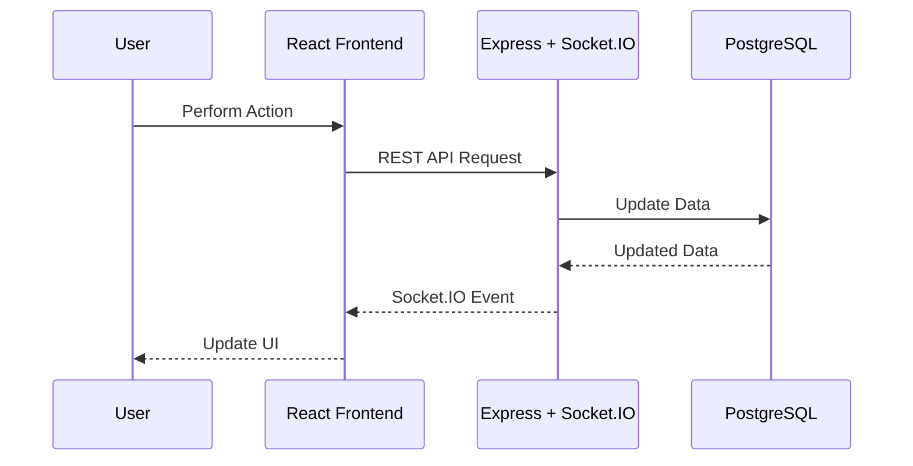

---

# Data Storage

LaporRuta menggunakan Supabase untuk persistent data.

### PostgreSQL

Digunakan untuk menyimpan data aplikasi seperti:

- Users.
- Wilayah.
- Categories.
- Reports.
- Report images metadata.
- Upvotes.
- Comments.
- Admin notes.
- Activity logs.
- Invitations.
- Disputes.
- Refresh tokens.

### Supabase Storage

Digunakan untuk menyimpan file gambar laporan.

```text
Report
  │
  ├── PostgreSQL
  │     └── Report metadata
  │
  └── Supabase Storage
        └── Report images
```

---

# Security

Beberapa mekanisme keamanan yang digunakan:

- JWT-based authentication.
- Refresh token.
- Role-Based Access Control.
- Protected routes.
- Password hashing.
- Request validation.
- Parameterized database queries.
- File upload validation.
- Server-side authorization.
- Region-based authorization untuk admin wilayah.
- Activity logging.
- Secret management menggunakan environment variables.

Credential dan secret tidak disimpan di source code.

---

# Deployment

Deployment yang digunakan pada submission:

```text
Frontend
    │
    ▼
 Netlify
    │
    │ HTTPS
    ▼
 ngrok
    │
    ▼
Home PC
    │
    ▼
 Docker
    │
    ▼
Node.js 24 + Express
    │
    ├───────────────┐
    ▼               ▼
Supabase DB    Supabase Storage
```

Frontend di-host menggunakan Netlify.

Backend dijalankan menggunakan Docker pada PC lokal dan diekspos menggunakan ngrok.

Database dan object storage menggunakan Supabase.

Detail deployment tersedia pada:

[Deployment Guide](./docs/06-deployment.md)

---

# SDG Alignment

LaporRuta memiliki keterkaitan dengan beberapa Sustainable Development Goals, terutama:

### SDG 11 — Sustainable Cities and Communities

LaporRuta mendukung pengelolaan lingkungan perkotaan dan partisipasi masyarakat melalui mekanisme pelaporan masalah fasilitas dan infrastruktur publik berbasis lokasi.

### SDG 9 — Industry, Innovation and Infrastructure

Platform memanfaatkan teknologi digital, geolocation, real-time communication, dan data-driven prioritization untuk membantu pengelolaan masalah infrastruktur.

Detail alignment tersedia pada:

[SDG Documentation](./docs/02-sdg.md)

---

# Future Development

Beberapa fitur yang dapat dikembangkan pada tahap berikutnya:

- Deteksi laporan duplikat.
- Pembukaan ulang / dispute laporan.
- Kompresi gambar client-side.
- Gamifikasi dan badge.
- Papan peringkat.
- Progressive Web App.
- Automatic face blurring.
- Dukungan multi-bahasa.
- Peningkatan public statistics.
- Dedicated cloud deployment.
- CI/CD pipeline.
- Monitoring dan centralized logging.

Fitur-fitur tersebut berada di luar scope implementasi submission saat ini.

---

# Project Status

LaporRuta telah mengimplementasikan core reporting workflow:

```text
Authentication
      │
      ▼
Create Report
      │
      ▼
Moderation
      │
      ▼
Verification
      │
      ▼
Assignment
      │
      ▼
In Progress
      │
      ▼
Resolved
```

Sistem juga telah mencakup:

- Public reporting.
- Location-based reporting.
- Community interaction.
- Administrative dashboard.
- Regional assignment.
- Priority scoring.
- Activity logging.
- Real-time updates.
- Image evidence.
- Report tracking.

---

# License

Project ini dibuat untuk kebutuhan kompetisi ITechnoCup 2026.
