# System Architecture

## 1. Overview

LaporRuta menggunakan arsitektur **client-server** dengan pemisahan antara frontend, backend, database, object storage, dan real-time communication.

Frontend bertanggung jawab terhadap antarmuka pengguna dan komunikasi dengan backend. Backend menjadi pusat business logic, authentication, authorization, validation, pengelolaan laporan, dan komunikasi dengan database serta storage.

Arsitektur sistem secara keseluruhan:

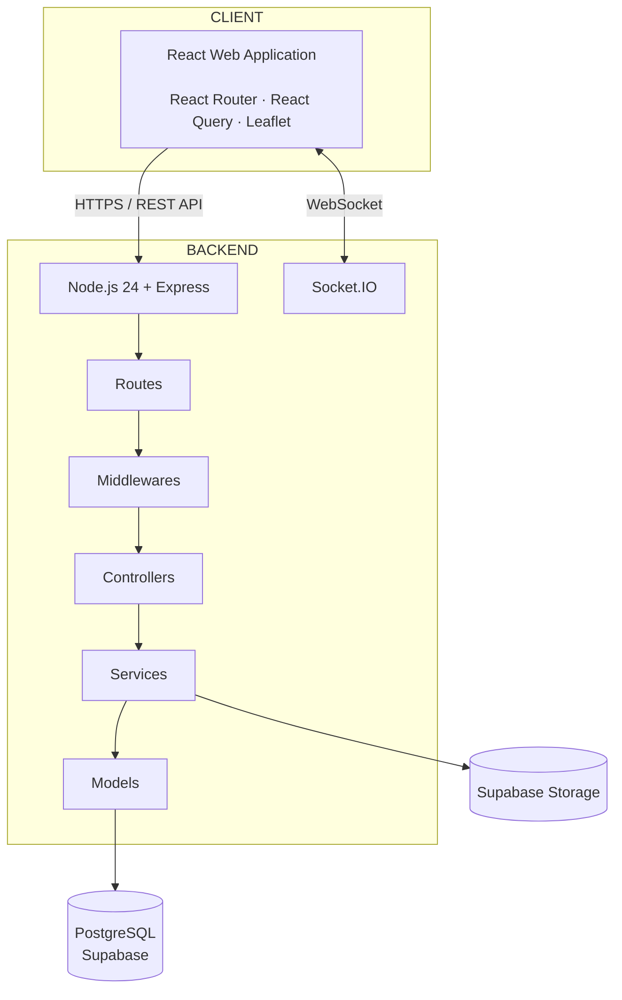

### Komponen Utama

| Komponen          | Teknologi            | Tanggung Jawab                                |
| ----------------- | -------------------- | --------------------------------------------- |
| Frontend          | React 19             | User interface                                |
| Routing           | React Router         | Client-side routing dan protected route       |
| Server State      | React Query          | Fetching, caching, mutation, dan server state |
| Mapping           | Leaflet              | Interactive map dan report marker             |
| Backend           | Node.js 24 + Express | REST API dan business logic                   |
| Database          | PostgreSQL           | Persistent relational data                    |
| Database Provider | Supabase             | PostgreSQL infrastructure                     |
| Object Storage    | Supabase Storage     | Penyimpanan gambar                            |
| Real-Time         | Socket.IO            | WebSocket communication                       |
| Container         | Docker               | Menjalankan backend secara konsisten          |
| Tunnel            | ngrok                | Mengekspos backend ke internet                |
| Frontend Hosting  | Netlify              | Hosting aplikasi frontend                     |

Supabase pada arsitektur ini digunakan untuk **PostgreSQL dan Storage**. Business logic aplikasi tetap berada pada backend LaporRuta.

---

# 2. Repository Architecture

Repository LaporRuta memisahkan frontend dan backend.

```text
laporruta-itechnocup2026/
│
├── frontend/
│
└── laporruta-backend/
    │
    ├── node_modules/
    ├── src/
    │   ├── config/
    │   ├── constants/
    │   ├── controllers/
    │   ├── middlewares/
    │   ├── models/
    │   ├── routes/
    │   ├── services/
    │   ├── utils/
    │   └── app.js
    │
    ├── .dockerignore
    ├── .env
    ├── Dockerfile
    ├── index.js
    ├── package.json
    └── package-lock.json
```

Struktur backend menggunakan pemisahan berdasarkan tanggung jawab sehingga setiap layer memiliki fungsi yang jelas.

---

# 3. Backend Architecture

Backend menggunakan pola **layered architecture**.

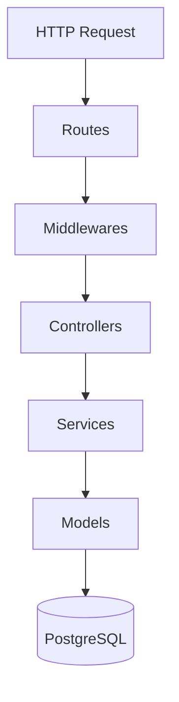

## 3.1 Routes

Routes mendefinisikan endpoint API dan menghubungkan request dengan middleware serta controller.

Domain utama API meliputi:

```text
/api/v1/auth
/api/v1/master
/api/v1/reports
/api/v1/reports/public
/api/v1/uploads
/api/v1/admin/wilayah
/api/v1/admin/pusat
/api/v1/admin/users
/api/v1/users
```

Endpoint tertentu juga menggunakan nested resource seperti:

```text
/reports/:id/upvotes
/reports/:id/comments
/reports/:id/activity-logs
```

---

## 3.2 Middlewares

Middleware menangani kebutuhan yang bersifat cross-cutting sebelum request masuk ke business logic.

Middleware utama:

| Middleware       | Fungsi                                                                 |
| ---------------- | ---------------------------------------------------------------------- |
| `authMiddleware` | Memverifikasi JWT access token dan memasukkan user ke `req.user`       |
| `roleMiddleware` | Membatasi endpoint berdasarkan role                                    |
| `authorizeZone`  | Memastikan Admin Wilayah hanya mengakses laporan pada wilayah tugasnya |
| `validateInput`  | Validasi body dan query                                                |
| `multerUpload`   | Menangani multipart upload dan validasi file                           |

`authMiddleware` tidak digunakan pada endpoint yang memang bersifat public seperti register, login, refresh, public map, categories, dan wilayah.

---

## 3.3 Controllers

Controller merupakan boundary antara HTTP layer dan business logic.

Controller bertanggung jawab untuk:

- Membaca request parameter.
- Membaca body dan query.
- Memanggil service.
- Mengembalikan HTTP response.
- Menangani response berdasarkan hasil service.

Business logic utama ditempatkan pada service layer.

---

## 3.4 Services

Service merupakan layer utama untuk business logic aplikasi.

Contoh tanggung jawab service:

- Authentication.
- User registration dan login.
- Refresh token.
- Create report.
- Report moderation.
- Report status management.
- Upvote.
- Comment.
- Activity logging.
- Priority calculation.
- Automatic assignment.
- Reassignment.
- Admin management.
- Invitation.
- Statistics.
- Image management.
- Real-time event broadcasting.

---

## 3.5 Models

Model bertanggung jawab terhadap akses data PostgreSQL.

Model menangani operasi database seperti:

- Query data.
- Insert.
- Update.
- Delete.
- Filtering.
- Pagination.
- Aggregation.
- Relational query.

Dengan pemisahan tersebut, service tidak perlu mencampurkan business logic dengan detail query database.

---

# 4. Frontend Architecture

Frontend LaporRuta menggunakan React sebagai web application.

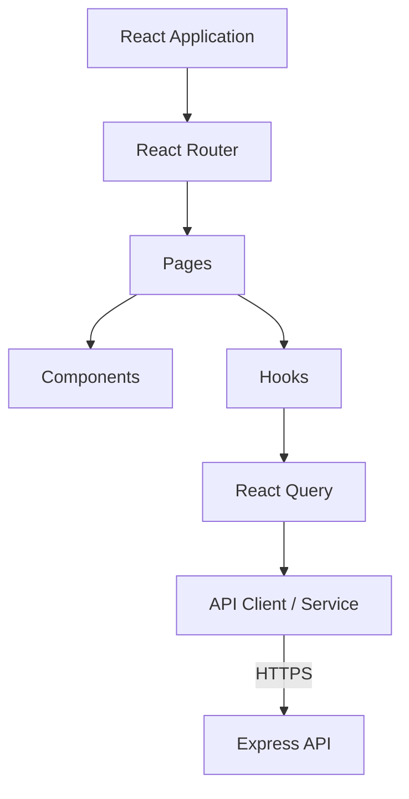

## 4.1 React Router

React Router digunakan untuk:

- Client-side navigation.
- Protected routes.
- Role-based page access.
- Public pages.
- Administrative pages.

Area utama aplikasi meliputi:

```text
/
/login
/register
/laporkan
/laporan-saya
/laporan/:id

/admin/wilayah
/admin/pusat
```

---

## 4.2 React Query

React Query digunakan untuk pengelolaan server state.

Fungsinya meliputi:

- Fetching API.
- Caching.
- Mutation.
- Loading state.
- Error state.
- Refetching.
- Query invalidation.

---

## 4.3 Leaflet

Leaflet digunakan untuk fitur pemetaan LaporRuta.

Penggunaannya meliputi:

- Public map.
- Report marker.
- Marker clustering.
- Pemilihan lokasi laporan.
- Mini-map.
- Visualisasi lokasi laporan.

---

# 5. Authentication Architecture

LaporRuta menggunakan **JWT access token** dan **refresh token**.

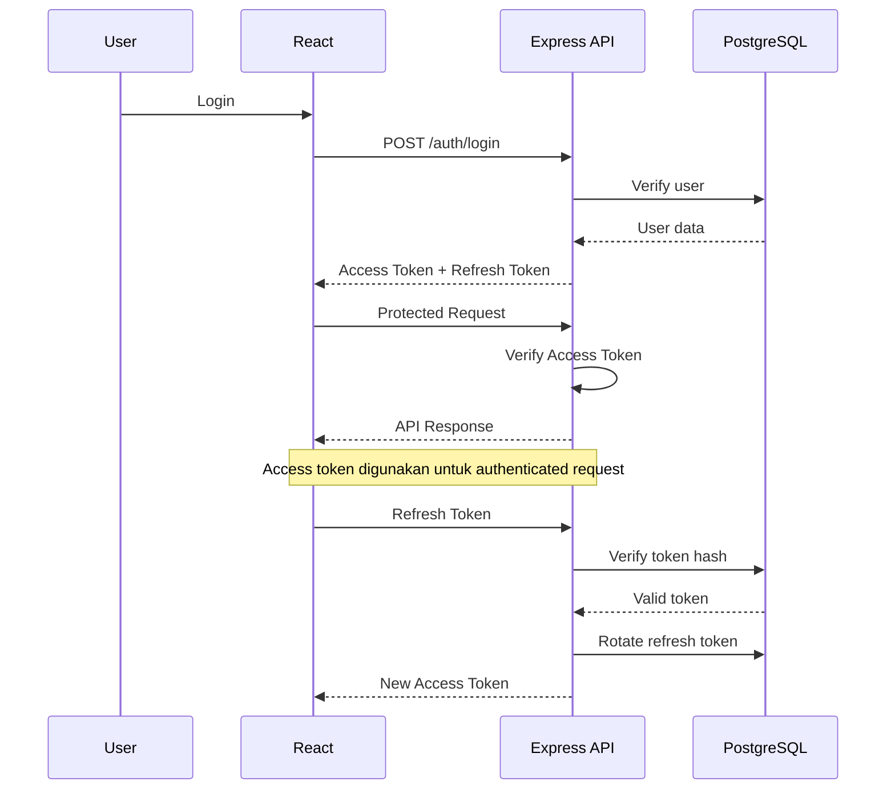

Refresh token disimpan pada tabel `refresh_tokens` dalam bentuk hash.

Authentication menggunakan:

```text
Access Token
    │
    └── JWT

Refresh Token
    │
    └── hashed value in database
```

---

# 6. Role-Based Access Control

LaporRuta memiliki tiga role utama:

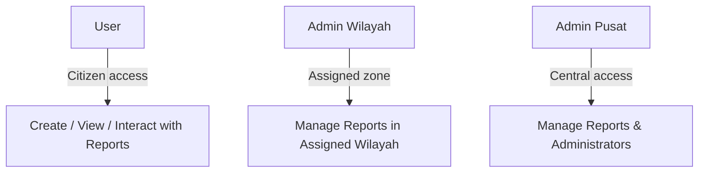

## User

User dapat:

- Membuat laporan.
- Melihat laporan publik.
- Melihat laporan sendiri.
- Memberikan upvote.
- Memberikan komentar.

## Admin Wilayah

Admin Wilayah dapat mengelola laporan yang berada pada wilayah tugasnya.

Pembatasan dilakukan berdasarkan:

```text
report.wilayah_id
        ==
user.assigned_wilayah_id
```

## Admin Pusat

Admin Pusat memiliki akses administratif tingkat pusat, termasuk:

- Monitoring seluruh laporan.
- Reassignment wilayah.
- Override.
- Admin management.
- Invitation.
- Statistics.
- Laporan zoneless.

---

# 7. Report Lifecycle

Laporan memiliki lifecycle sebagai berikut:

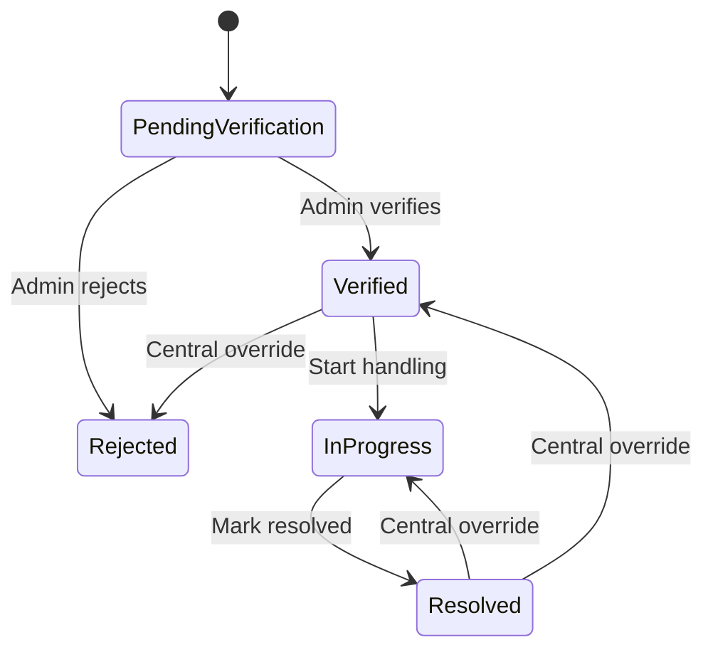

Transisi normal:

```text
Pending Verification
        ↓
     Verified
        ↓
   In Progress
        ↓
     Resolved
```

Penolakan dilakukan dari status `Pending Verification`.

## Admin Pusat memiliki kemampuan override untuk menangani perubahan status yang membutuhkan eskalasi. API Contract juga menetapkan bahwa progres normal Admin Wilayah bergerak maju, sementara perubahan mundur membutuhkan override Admin Pusat.

# 8. Create Report Flow

Flow pembuatan laporan:

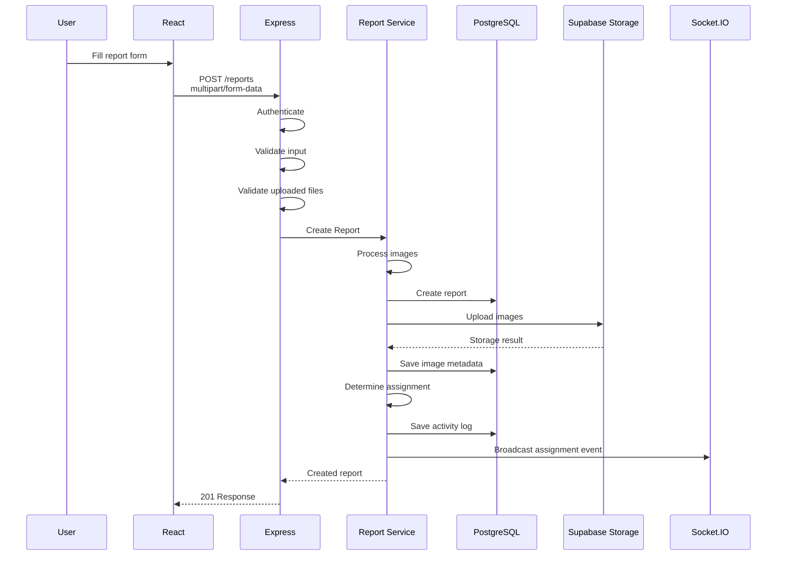

Proses create report mencakup validasi form, validasi file, image processing menggunakan Sharp, upload ke Supabase Storage, penyimpanan report dengan status `pending_verification`, automatic assignment, audit trail, dan broadcast real-time.

---

# 9. Automatic Assignment

Setiap laporan memiliki `wilayah_id`.

Sistem menggunakan wilayah tersebut untuk menentukan administrator yang bertanggung jawab.

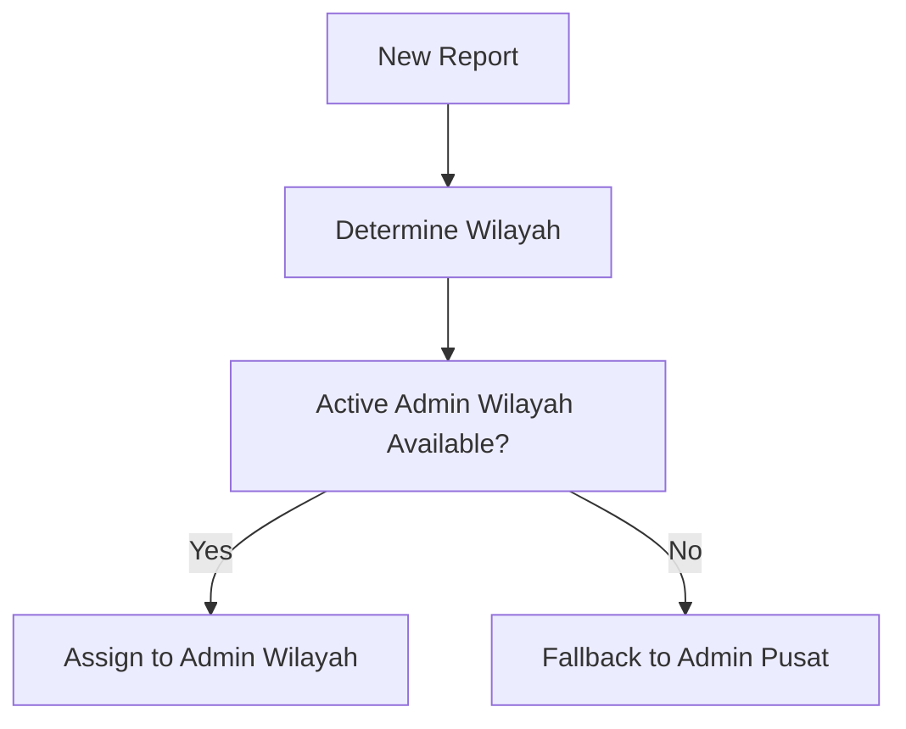

Jika Admin Wilayah aktif tersedia pada zona tersebut, laporan masuk ke antrian admin wilayah.

Jika tidak tersedia, laporan masuk ke fallback Admin Pusat.

Admin Pusat juga dapat melakukan reassignment ke zona lain. Jika zona baru tidak memiliki admin aktif, laporan kembali menggunakan fallback Admin Pusat.

---

# 10. Real-Time Architecture

Socket.IO digunakan untuk komunikasi real-time antara backend dan client.

## 10.1 Room Architecture

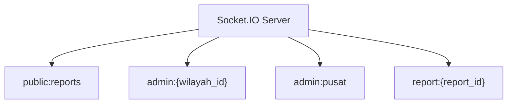

Room yang digunakan:

| Room                 | Client                           |
| -------------------- | -------------------------------- |
| `public:reports`     | Semua client termasuk guest      |
| `admin:{wilayah_id}` | Admin Wilayah                    |
| `admin:pusat`        | Admin Pusat                      |
| `report:{report_id}` | User yang membuka detail laporan |

Room architecture tersebut sesuai dengan API Contract LaporRuta.

---

## 10.2 Server Events

Event utama:

| Event                      | Target                               |
| -------------------------- | ------------------------------------ |
| `report:verified`          | Public + Admin Wilayah               |
| `report:status_changed`    | Public + Admin Wilayah + Admin Pusat |
| `report:new`               | Public                               |
| `report:upvote_changed`    | Public + Report Room                 |
| `report:zone_reassigned`   | Old Zone + New Zone + Admin Pusat    |
| `admin:report_assigned`    | Admin Wilayah / Admin Pusat          |
| `admin:override_performed` | Admin Pusat                          |
| `connection:status`        | Individual socket                    |

API Contract mendefinisikan event-event tersebut beserta target room dan trigger-nya.

---

# 11. Image Storage Architecture

Gambar tidak disimpan sebagai binary data pada PostgreSQL.

Backend menerima file dari frontend kemudian memproses dan mengunggahnya ke Supabase Storage.

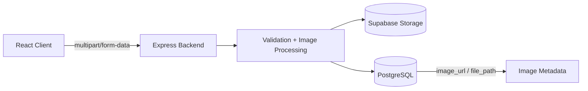

Database hanya menyimpan metadata gambar pada `report_images`, sedangkan file aktual disimpan pada Supabase Storage.

Tipe gambar dibedakan menggunakan:

```text
is_after = false
    → foto kondisi awal

is_after = true
    → foto setelah perbaikan
```

---

# 12. API Communication

Komunikasi frontend dan backend menggunakan REST API.

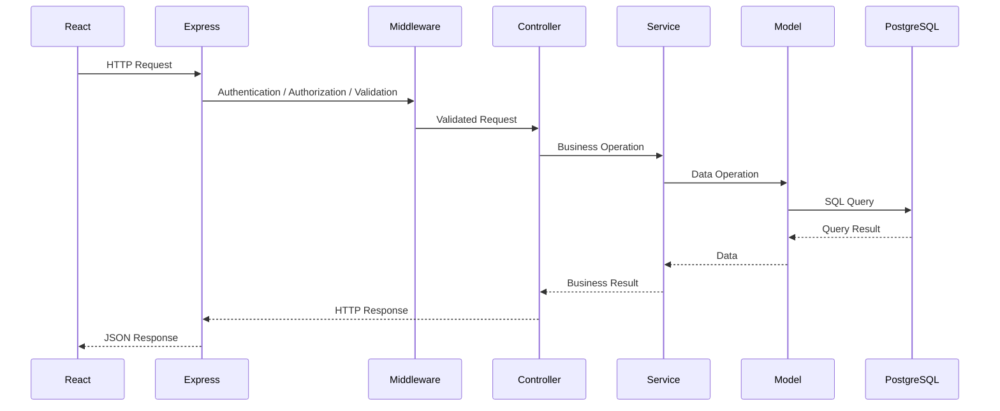

Response API menggunakan struktur standar:

```json
{
  "code": 200,
  "message": "successfully",
  "result": {}
}
```

---

# 13. Priority Calculation

Priority score digunakan untuk membantu administrator menentukan prioritas laporan.

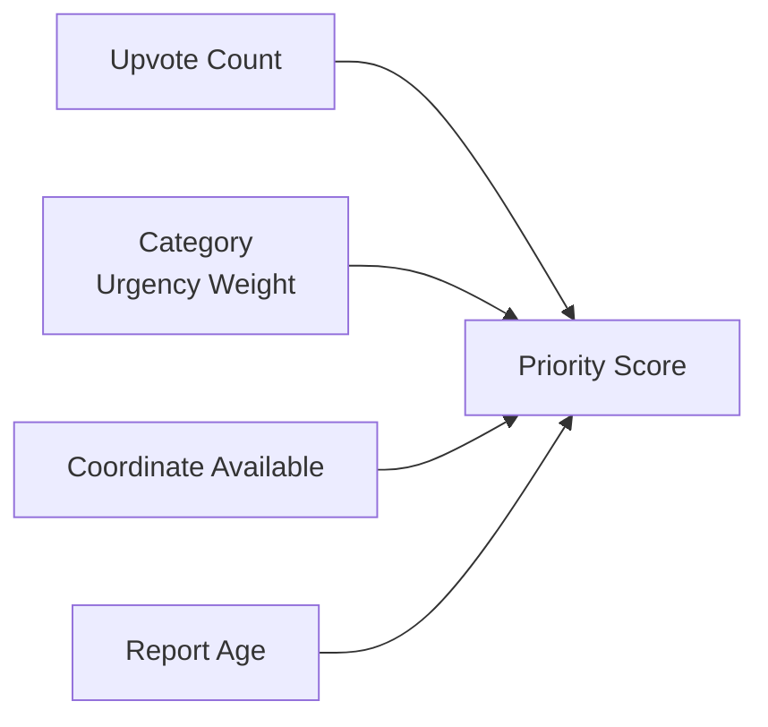

Formula:

```text
Priority Score =
    (Upvotes × 3)
  + (Category Urgency Weight × 5)
  + (Has Coordinate ? 2 : 0)
  − (Report Age in Days × 0.5)
```

Score dihitung secara on-the-fly pada query backend dan memiliki floor `0`.

---

# 14. Security Architecture

Security diterapkan pada beberapa layer.

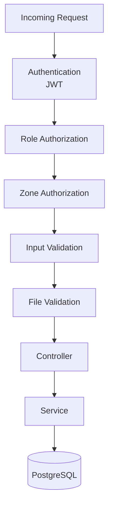

Mekanisme utama:

- JWT authentication.
- Role-based authorization.
- Zone-based authorization.
- Input validation.
- Multipart file validation.
- MIME validation.
- Magic-number validation.
- File size limitation.
- Parameterized database query.
- Refresh token hashing.
- Activity logging.

---

# 15. Deployment Architecture

Deployment LaporRuta untuk kondisi submission saat ini terdiri dari frontend yang di-host pada Netlify dan backend yang berjalan pada PC menggunakan Docker.

ngrok digunakan sebagai public tunnel menuju backend.

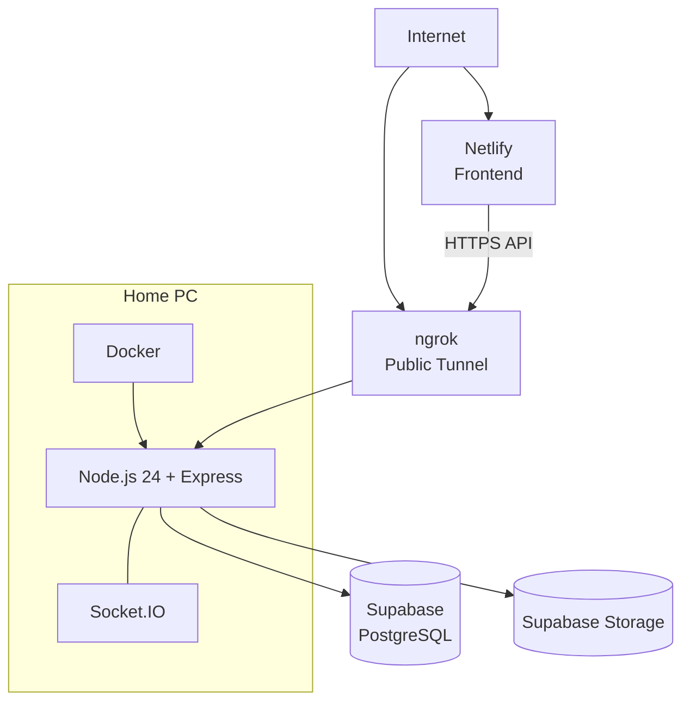

### Frontend

Frontend production dijalankan melalui Netlify.

### Backend

Backend dijalankan pada PC menggunakan Docker.

### Public Access

ngrok menyediakan public endpoint yang mengarah ke backend yang berjalan pada PC.

### Database

PostgreSQL menggunakan Supabase.

### Storage

Supabase Storage digunakan untuk file gambar.

---

# 16. Architectural Data Flow

Secara keseluruhan, aliran data utama LaporRuta adalah:

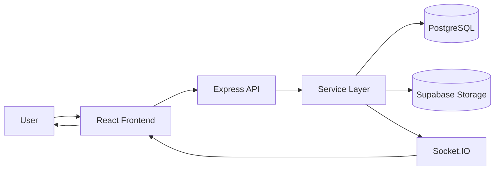

Backend menjadi pusat koordinasi antara client, persistent data, storage, dan real-time communication.

---

# 17. Architectural Principles

Arsitektur LaporRuta mengikuti prinsip berikut:

### 17.1 Separation of Concerns

Frontend, routing, middleware, controller, service, model, database, dan storage memiliki tanggung jawab yang terpisah.

### 17.2 Role-Based Responsibility

Akses administratif dibatasi berdasarkan role dan wilayah tugas.

### 17.3 Location-Based Processing

Wilayah menjadi bagian penting dalam pengelolaan dan assignment laporan.

### 17.4 API-First Communication

Frontend dan backend berkomunikasi melalui API yang terstruktur.

### 17.5 Centralized Business Logic

Business logic ditempatkan pada service layer backend.

### 17.6 Auditability

Aktivitas penting terhadap laporan dicatat dalam activity log.

### 17.7 Real-Time Feedback

Perubahan tertentu dikirim melalui Socket.IO agar client dapat menerima update tanpa menunggu refresh manual.

### 17.8 Infrastructure Separation

Database dan object storage dipisahkan dari application server sehingga masing-masing memiliki tanggung jawab yang jelas.

---

_End of Document_
