# Database Design

## 1. Overview

LaporRuta menggunakan **PostgreSQL** sebagai relational database.

Database menyimpan data utama aplikasi yang meliputi:

- User dan role.
- Refresh token.
- Struktur wilayah.
- Kategori laporan.
- Laporan.
- Gambar laporan.
- Upvote.
- Komentar.
- Catatan internal administrator.
- Activity log.
- Invitation administrator.
- Dispute.

Supabase digunakan sebagai provider PostgreSQL dan object storage.

---

# 2. Entity Relationship Diagram

Relasi logical antar entity utama LaporRuta:

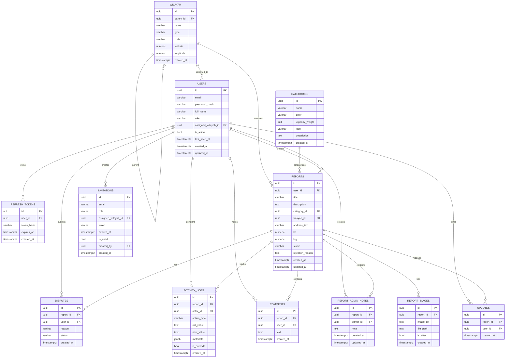

> ERD di atas menggambarkan hubungan logical berdasarkan penggunaan foreign-key identifiers pada schema. Detail constraint foreign key fisik mengikuti implementasi database aktual.

---

# 3. Table `wilayah`

Tabel `wilayah` menyimpan struktur wilayah administratif.

### Columns

| Name         | Type          | Constraints      |
| ------------ | ------------- | ---------------- |
| `id`         | `uuid`        | Primary          |
| `parent_id`  | `uuid`        | Nullable         |
| `name`       | `varchar`     |                  |
| `type`       | `varchar`     |                  |
| `code`       | `varchar`     | Nullable, Unique |
| `latitude`   | `numeric`     | Nullable         |
| `longitude`  | `numeric`     | Nullable         |
| `created_at` | `timestamptz` |                  |

### Fungsi

Digunakan untuk:

- Hierarki wilayah.
- Menentukan lokasi administratif laporan.
- Menentukan wilayah tugas Admin Wilayah.
- Automatic assignment.
- Reassignment laporan.

### Hierarki

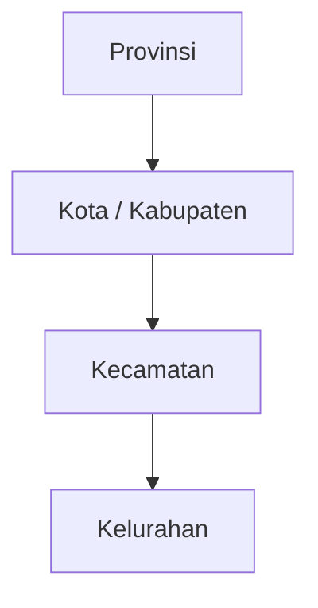

`parent_id` digunakan untuk menghubungkan sebuah wilayah dengan parent wilayahnya.

---

# 4. Table `categories`

Tabel `categories` menyimpan master kategori laporan.

### Columns

| Name             | Type          | Constraints |
| ---------------- | ------------- | ----------- |
| `id`             | `uuid`        | Primary     |
| `name`           | `varchar`     | Unique      |
| `color`          | `varchar`     |             |
| `urgency_weight` | `int4`        |             |
| `icon`           | `varchar`     | Nullable    |
| `description`    | `text`        | Nullable    |
| `created_at`     | `timestamptz` |             |

### Fungsi

Kategori digunakan untuk:

- Klasifikasi laporan.
- Warna marker.
- Icon laporan.
- Deskripsi kategori.
- Menentukan urgency weight.

`urgency_weight` menjadi salah satu input Priority Score.

---

# 5. Table `users`

Tabel `users` menyimpan akun masyarakat dan administrator.

### Columns

| Name                  | Type          | Constraints |
| --------------------- | ------------- | ----------- |
| `id`                  | `uuid`        | Primary     |
| `email`               | `varchar`     | Unique      |
| `password_hash`       | `varchar`     |             |
| `full_name`           | `varchar`     |             |
| `role`                | `varchar`     |             |
| `assigned_wilayah_id` | `uuid`        | Nullable    |
| `is_active`           | `bool`        |             |
| `last_seen_at`        | `timestamptz` | Nullable    |
| `created_at`          | `timestamptz` |             |
| `updated_at`          | `timestamptz` |             |

### Role

Role utama:

```text
user
admin_wilayah
admin_pusat
```

### `assigned_wilayah_id`

Digunakan untuk menentukan wilayah tugas Admin Wilayah.

Untuk Admin Pusat, nilai ini dapat bernilai `NULL`.

### `is_active`

Menentukan apakah akun administrator aktif.

---

# 6. Table `refresh_tokens`

Tabel `refresh_tokens` menyimpan session refresh token.

### Columns

| Name         | Type          | Constraints |
| ------------ | ------------- | ----------- |
| `id`         | `uuid`        | Primary     |
| `user_id`    | `uuid`        |             |
| `token_hash` | `varchar`     | Unique      |
| `expires_at` | `timestamptz` |             |
| `created_at` | `timestamptz` |             |

### Authentication Flow


Database menyimpan `token_hash`, bukan nilai token yang digunakan oleh client.

---

# 7. Table `reports`

`reports` merupakan entity utama aplikasi.

### Columns

| Name               | Type          | Constraints |
| ------------------ | ------------- | ----------- |
| `id`               | `uuid`        | Primary     |
| `user_id`          | `uuid`        |             |
| `title`            | `varchar`     |             |
| `description`      | `text`        |             |
| `category_id`      | `uuid`        |             |
| `wilayah_id`       | `uuid`        |             |
| `address_text`     | `varchar`     |             |
| `lat`              | `numeric`     | Nullable    |
| `lng`              | `numeric`     | Nullable    |
| `status`           | `varchar`     |             |
| `rejection_reason` | `text`        | Nullable    |
| `created_at`       | `timestamptz` |             |
| `updated_at`       | `timestamptz` |             |

### Relationship

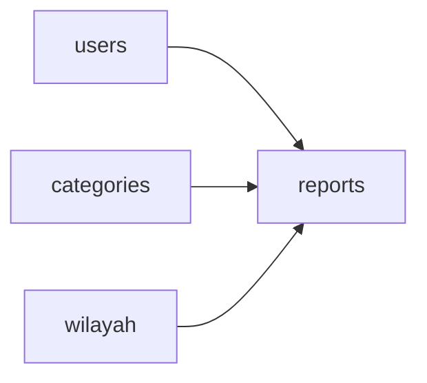

### Status

Status laporan:

```text
pending_verification
verified
in_progress
resolved
rejected
```

### Location

`lat` dan `lng` dapat bernilai `NULL`.

Jika tersedia, koordinat digunakan untuk:

- Menampilkan lokasi pada map.
- Menentukan posisi marker.
- Mendukung location-based processing.
- Memberikan bonus koordinat pada Priority Score.

---

# 8. Table `report_images`

Tabel `report_images` menyimpan metadata gambar laporan.

### Columns

| Name         | Type          | Constraints |
| ------------ | ------------- | ----------- |
| `id`         | `uuid`        | Primary     |
| `report_id`  | `uuid`        |             |
| `image_url`  | `text`        |             |
| `file_path`  | `text`        |             |
| `is_after`   | `bool`        |             |
| `created_at` | `timestamptz` |             |

### Storage Architecture

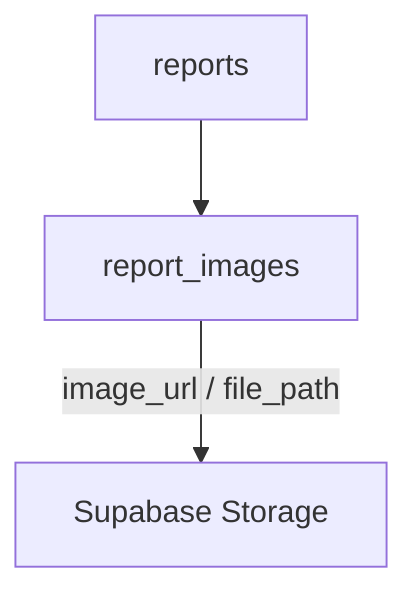

Database menyimpan metadata, sedangkan file aktual berada pada Supabase Storage.

### `is_after`

```text
false
→ foto kondisi awal

true
→ foto setelah perbaikan
```

---

# 9. Table `upvotes`

Tabel `upvotes` menyimpan dukungan user terhadap laporan.

### Columns

| Name         | Type          | Constraints |
| ------------ | ------------- | ----------- |
| `id`         | `uuid`        | Primary     |
| `report_id`  | `uuid`        |             |
| `user_id`    | `uuid`        |             |
| `created_at` | `timestamptz` |             |

### Relationship

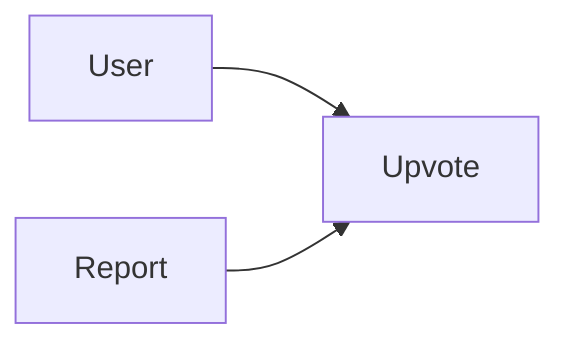

Jumlah upvote digunakan sebagai salah satu faktor Priority Score.

---

# 10. Table `report_admin_notes`

Tabel `report_admin_notes` menyimpan catatan internal administrator.

### Columns

| Name         | Type          | Constraints |
| ------------ | ------------- | ----------- |
| `id`         | `uuid`        | Primary     |
| `report_id`  | `uuid`        |             |
| `admin_id`   | `uuid`        |             |
| `note`       | `text`        |             |
| `created_at` | `timestamptz` |             |
| `updated_at` | `timestamptz` |             |

Catatan ini digunakan untuk kebutuhan internal administrator dan bukan bagian dari informasi publik laporan.

---

# 11. Table `activity_logs`

Tabel `activity_logs` menyediakan audit trail untuk aktivitas laporan.

### Columns

| Name          | Type          | Constraints |
| ------------- | ------------- | ----------- |
| `id`          | `uuid`        | Primary     |
| `report_id`   | `uuid`        |             |
| `actor_id`    | `uuid`        | Nullable    |
| `action_type` | `varchar`     |             |
| `old_value`   | `text`        | Nullable    |
| `new_value`   | `text`        | Nullable    |
| `metadata`    | `jsonb`       | Nullable    |
| `is_override` | `bool`        |             |
| `created_at`  | `timestamptz` |             |

### Audit Flow

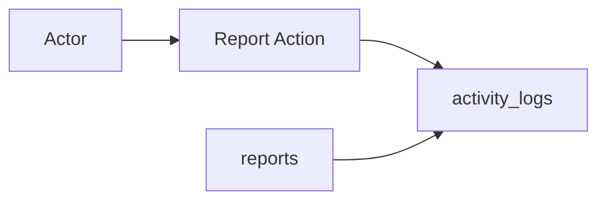

Data yang dapat dicatat meliputi:

- Pembuatan laporan.
- Verifikasi.
- Penolakan.
- Perubahan status.
- Upvote.
- Reassignment.
- Override.
- Aktivitas administratif lainnya.

`old_value` dan `new_value` digunakan untuk merekam perubahan nilai.

`metadata` menyimpan informasi tambahan dalam format JSON.

`is_override` menandai tindakan override.

---

# 12. Table `invitations`

Tabel `invitations` menyimpan invitation untuk administrator baru.

### Columns

| Name                  | Type          | Constraints |
| --------------------- | ------------- | ----------- |
| `id`                  | `uuid`        | Primary     |
| `email`               | `varchar`     |             |
| `role`                | `varchar`     |             |
| `assigned_wilayah_id` | `uuid`        | Nullable    |
| `token`               | `varchar`     | Unique      |
| `expires_at`          | `timestamptz` |             |
| `is_used`             | `bool`        |             |
| `created_by`          | `uuid`        |             |
| `created_at`          | `timestamptz` |             |

### Invitation Flow

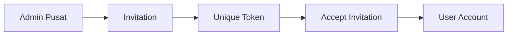

Untuk Admin Wilayah, invitation dapat menyertakan `assigned_wilayah_id`.

---

# 13. Table `comments`

Tabel `comments` menyimpan komentar pada laporan.

### Columns

| Name         | Type          | Constraints |
| ------------ | ------------- | ----------- |
| `id`         | `uuid`        | Primary     |
| `report_id`  | `uuid`        |             |
| `user_id`    | `uuid`        |             |
| `text`       | `text`        |             |
| `created_at` | `timestamptz` |             |

### Relationship

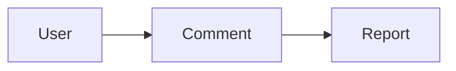

Komentar digunakan sebagai mekanisme interaksi masyarakat terhadap laporan.

---

# 14. Table `disputes`

Tabel `disputes` menyimpan data dispute terhadap laporan.

### Columns

| Name         | Type          | Constraints |
| ------------ | ------------- | ----------- |
| `id`         | `uuid`        | Primary     |
| `report_id`  | `uuid`        |             |
| `user_id`    | `uuid`        |             |
| `reason`     | `varchar`     |             |
| `status`     | `varchar`     |             |
| `created_at` | `timestamptz` |             |

### Relationship

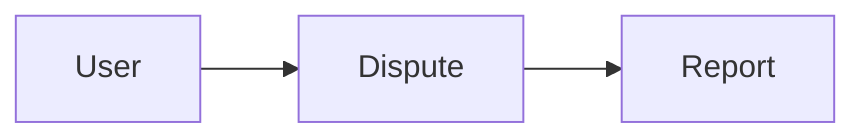

Entity `disputes` disiapkan untuk kebutuhan mekanisme dispute atau tinjauan ulang laporan.

---

# 15. Core Relationship Map

Entity yang paling penting dalam sistem berpusat pada `reports`.

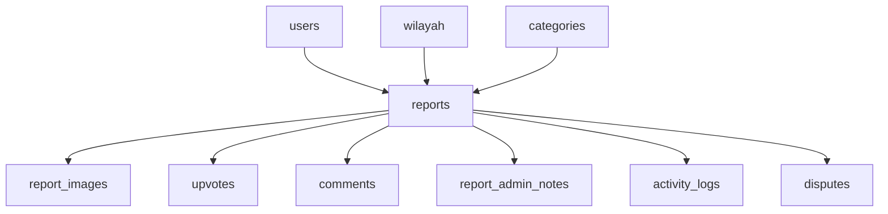

Dengan demikian:

```text
users
   │
   └──────────────┐
                  ▼
categories ───► reports ◄─── wilayah
                  │
       ┌──────────┼──────────┬──────────┬──────────┐
       ▼          ▼          ▼          ▼          ▼
 report_images  upvotes   comments   admin_notes  activity_logs

                  │
                  ▼
               disputes
```

---

# 16. Authentication Data Relationship

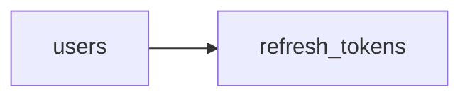

Satu user dapat memiliki refresh token yang digunakan untuk mempertahankan authenticated session.

---

# 17. Administration Data Relationship

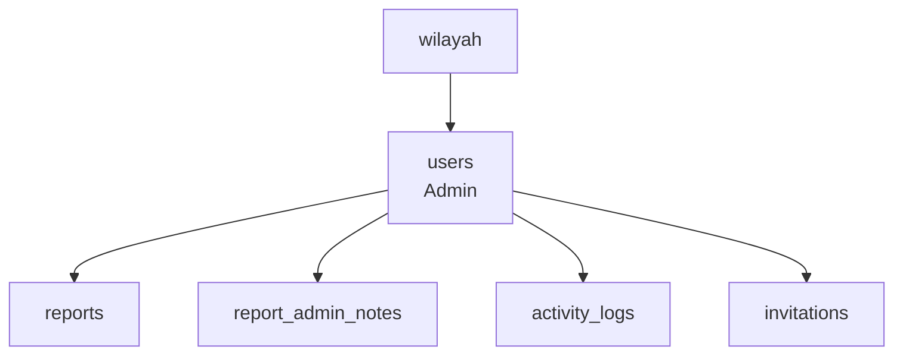

`assigned_wilayah_id` pada user menghubungkan Admin Wilayah dengan zona tugasnya.

---

# 18. Report Data Lifecycle

Data laporan berkembang melalui beberapa entity:

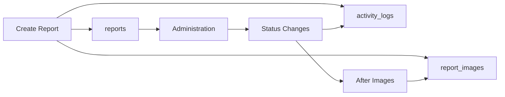

---

# 19. Priority Score Data Sources

Priority Score menggunakan data dari `reports`, `categories`, dan `upvotes`.

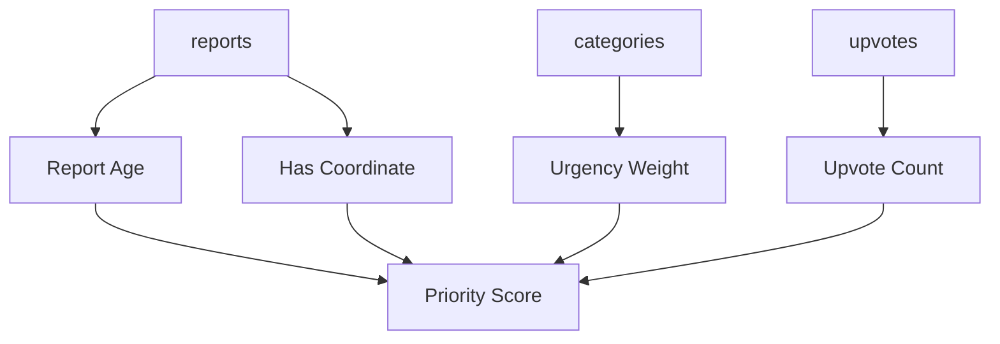

Formula:

```text
Priority Score =
    (Jumlah Upvote × 3)
  + (Bobot Urgensi Kategori × 5)
  + (Memiliki Koordinat ? 2 : 0)
  − (Usia Laporan dalam Hari × 0.5)
```

Implementasi SQL menghitung score secara on-the-fly menggunakan jumlah upvote, `categories.urgency_weight`, keberadaan koordinat, dan usia laporan. Score memiliki floor `0`.

---

# 20. Data Integrity

Constraint utama yang didefinisikan pada schema meliputi:

### Primary Key

Setiap tabel menggunakan UUID sebagai primary key.

### Unique

Field yang memiliki unique constraint:

```text
users.email
categories.name
wilayah.code
refresh_tokens.token_hash
invitations.token
```

### Nullable

Field nullable digunakan untuk data yang memang tidak selalu tersedia, seperti:

```text
wilayah.parent_id
wilayah.code
wilayah.latitude
wilayah.longitude

users.assigned_wilayah_id
users.last_seen_at

reports.lat
reports.lng
reports.rejection_reason

activity_logs.actor_id
activity_logs.old_value
activity_logs.new_value
activity_logs.metadata

invitations.assigned_wilayah_id
```

---

# 21. Database vs Object Storage

PostgreSQL dan Supabase Storage memiliki tanggung jawab berbeda.

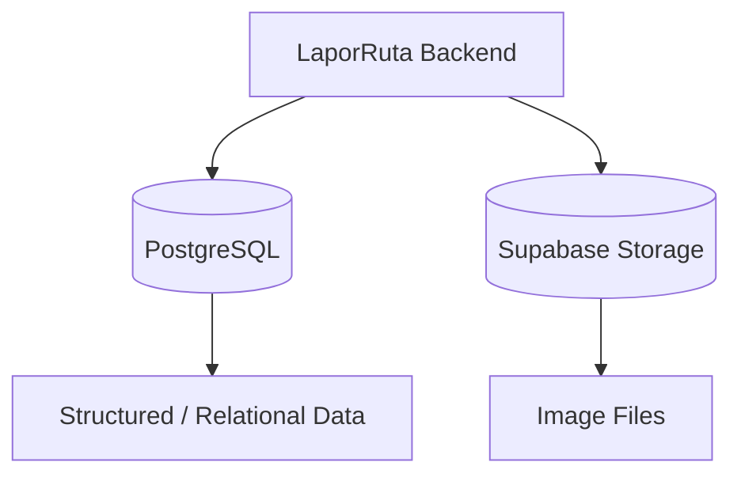

### PostgreSQL

Menyimpan:

- User.
- Reports.
- Categories.
- Wilayah.
- Upvotes.
- Comments.
- Activity logs.
- Admin notes.
- Invitations.
- Refresh tokens.
- Disputes.
- Image metadata.

### Supabase Storage

Menyimpan:

- Gambar laporan.
- Gambar setelah perbaikan.

---

# 22. Database Responsibilities

Database LaporRuta bertanggung jawab terhadap beberapa domain:

| Domain         | Tables                              |
| -------------- | ----------------------------------- |
| Identity       | `users`, `refresh_tokens`           |
| Master Data    | `wilayah`, `categories`             |
| Reporting      | `reports`, `report_images`          |
| Community      | `upvotes`, `comments`               |
| Administration | `report_admin_notes`, `invitations` |
| Audit          | `activity_logs`                     |
| Review         | `disputes`                          |

---

# 23. Summary

Struktur database LaporRuta berpusat pada entity `reports`, yang menghubungkan user, wilayah, kategori, media, interaksi masyarakat, aktivitas administratif, dan dispute.

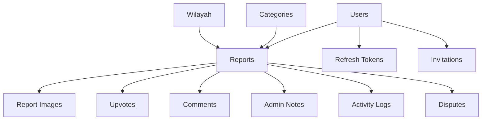

Desain tersebut memungkinkan LaporRuta menyimpan data aplikasi secara terstruktur sekaligus mendukung kebutuhan utama sistem: authentication, location-based reporting, community interaction, regional administration, audit trail, priority scoring, dan media storage.

---

_End of Document_
