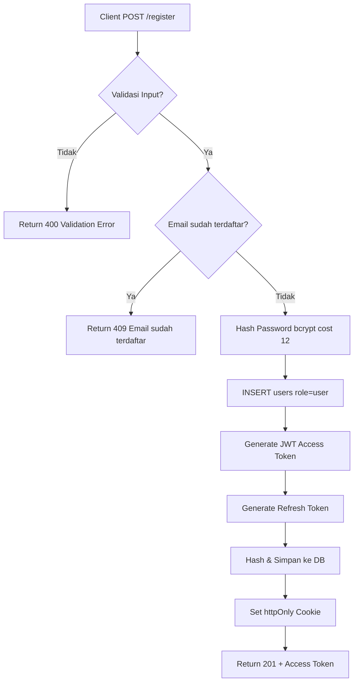
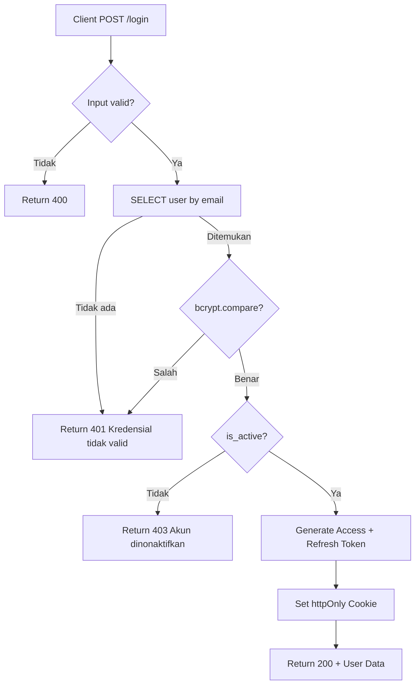
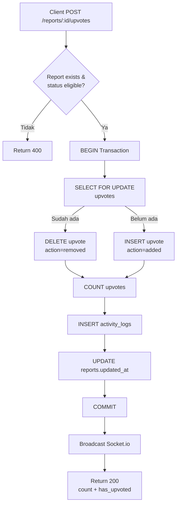

# API Contract - LaporRuta

## 1. Global Configuration Network

### 1.1 Base URLs

| Environment | Base URL                       |
| ----------- | ------------------------------ |
| Development | `http://localhost:8080/api/v1` |

### 1.2 Global Headers

| Header       | Value              | Required | Description                          |
| ------------ | ------------------ | -------- | ------------------------------------ |
| Content-Type | `application/json` | yes      | request body format                  |
| Accept       | `application/json` | yes      | response format                      |
| X-Request-ID | UUID               | no       | trace ID untuk logging dan debugging |

### 1.3 Response Format

#### Success Response

##### Generic

```json
{
  "code": 200,
  "message": "successfully",
  "result": {}
}
```

##### Pagination & Metadata

```json
{
  "code": 200,
  "message": "successfully",
  "result": {
    "data": [],
    "metadata": {
      "current_page": 1,
      "page_size": 20,
      "total_pages": 5,
      "total_items": 98,
      "has_next_page": true,
      "has_prev_page": false
    }
  }
}
```

#### Error Response

```json
{
  "code": 400,
  "message": "validation error",
  "error": "detail error..."
}
```

---

## 2. Authentication Service

**Base Path:** `/auth`

### 2.1 Register - `POST /register`

**Deskripsi:**  
Endpoint untuk registrasi warga baru. Sistem akan melakukan validasi input, memastikan email belum terdaftar, meng-hash password dengan bcrypt (cost factor 12), menyimpan user ke database dengan role default `user`, lalu menerbitkan pasangan token (access token JWT 15 menit + refresh token 7 hari). Refresh token disimpan di database dalam bentuk hash dan dikirim ke client via `httpOnly` cookie.

**Auth:** Tidak diperlukan  
**Role:** Public

#### Request

**Headers:**
| Header | Value |
| ------------ | ------------------ |
| Content-Type | `application/json` |

**Body:**

```json
{
  "full_name": "Budi Santoso",
  "email": "budi@email.com",
  "password": "password123",
  "confirm_password": "password123"
}
```

| Field              | Type   | Required | Rules                                 |
| ------------------ | ------ | -------- | ------------------------------------- |
| `full_name`        | string | yes      | max 255 karakter                      |
| `email`            | string | yes      | valid format RFC 5322, auto lowercase |
| `password`         | string | yes      | min 8, max 100 karakter               |
| `confirm_password` | string | yes      | harus identik dengan `password`       |

#### Response - `201 Created`

```json
{
  "code": 201,
  "message": "registrasi berhasil",
  "result": {
    "user": {
      "id": "550e8400-e29b-41d4-a716-446655440000",
      "email": "budi@email.com",
      "full_name": "Budi Santoso",
      "role": "user"
    },
    "access_token": "eyJhbGciOiJIUzI1NiIs..."
  }
}
```

**Cookie yang di-set oleh server:**

```
Set-Cookie: refresh_token=<random-256-bit-hex>; HttpOnly; Secure; SameSite=Strict; Max-Age=604800; Path=/
```

#### Logic Flow

```
1. Validasi format input (Joi/Zod)
2. Cek email duplikat di tabel users
   └── Jika ada → return 409 "Email sudah terdaftar"
3. Hash password dengan bcrypt(cost=12)
4. INSERT users (role='user', is_active=true)
5. Generate access_token (JWT, 15 menit)
6. Generate refresh_token (crypto.randomBytes 32)
   ├── Hash refresh_token dengan SHA-256
   ├── INSERT refresh_tokens (expires 7 hari)
   └── Set httpOnly cookie
7. Return 201 dengan access_token di body
```

#### Flowchart



---

### 2.2 Login - `POST /login`

**Deskripsi:**  
Endpoint login universal untuk semua peran (warga, admin wilayah, admin pusat). Sistem mencari user berdasarkan email, memverifikasi password dengan bcrypt.compare, memastikan akun aktif (`is_active = true`), lalu menerbitkan pasangan token baru. Jika gagal, sistem selalu mengembalikan pesan generik **"Kredensial tidak valid"** tanpa membedakan apakah email tidak ditemukan atau password salah (keamanan enumerasi).

**Auth:** Tidak diperlukan  
**Role:** Public

#### Request

**Body:**

```json
{
  "email": "budi@email.com",
  "password": "password123"
}
```

#### Response - `200 OK`

```json
{
  "code": 200,
  "message": "login berhasil",
  "result": {
    "user": {
      "id": "550e8400-e29b-41d4-a716-446655440000",
      "email": "budi@email.com",
      "full_name": "Budi Santoso",
      "role": "user",
      "assigned_wilayah_id": null
    },
    "access_token": "eyJhbGciOiJIUzI1NiIs..."
  }
}
```

**Catatan:** Frontend membaca `user.role` untuk menentukan redirect:

- `user` → `/` (Peta Publik)
- `admin_wilayah` → `/admin/wilayah`
- `admin_pusat` → `/admin/pusat`

#### Logic Flow

```
1. Validasi input email & password (wajib ada)
2. SELECT users WHERE email = $1
   └── Jika tidak ditemukan → return 401 "Kredensial tidak valid"
3. bcrypt.compare(inputPassword, storedHash)
   └── Jika false → return 401 "Kredensial tidak valid"
4. Cek user.is_active
   └── Jika false → return 403 "Akun dinonaktifkan"
5. Generate access_token (JWT 15 menit, payload: sub, role, assigned_wilayah_id)
6. Generate refresh_token → hash → simpan DB → set httpOnly cookie
7. Return 200 dengan user data & access_token
```

#### Flowchart



---

### 2.3 Refresh Token - `POST /refresh`

**Deskripsi:**  
Endpoint untuk memperbarui access token yang sudah expired. Client tidak perlu mengirim body apapun; refresh token diambil dari `httpOnly` cookie. Server akan memverifikasi hash refresh token di database, memastikan belum expired, menghapus token lama (rotation), menerbitkan access token baru + refresh token baru, lalu mengupdate cookie.

**Auth:** Refresh Token via Cookie  
**Role:** Public (siapapun yang punya cookie valid)

#### Request

**Cookie:**

```
refresh_token=<random-256-bit-hex>
```

**Body:** _Tidak ada_

#### Response - `200 OK`

```json
{
  "code": 200,
  "message": "token berhasil diperbarui",
  "result": {
    "access_token": "eyJhbGciOiJIUzI1NiIs..."
  }
}
```

**Cookie baru di-set (overwrite):**

```
Set-Cookie: refresh_token=<new-token>; HttpOnly; Secure; SameSite=Strict; Max-Age=604800; Path=/
```

#### Logic Flow

```
1. Ambil refresh_token dari req.cookies
   └── Jika tidak ada → return 401
2. SHA-256 hash token → cari di refresh_tokens
   └── Jika tidak ditemukan atau expired → hapus cookie → return 401
3. SELECT user terkait → cek is_active
   └── Jika nonaktif → return 403
4. DELETE refresh_tokens record lama (rotation)
5. Generate refresh_token baru → hash → INSERT DB
6. Generate access_token baru (JWT 15 menit)
7. Set cookie baru (overwrite)
8. Return 200 dengan access_token baru
```

---

### 2.4 Logout - `POST /logout`

**Deskripsi:**  
Endpoint untuk mengakhiri sesi. Server akan menghapus refresh token dari database (blacklist), menghapus httpOnly cookie client-side, dan menginstruksikan frontend untuk menghapus access token dari memory.

**Auth:** Access Token (Bearer) + Refresh Cookie  
**Role:** All

#### Request

**Headers:**

```
Authorization: Bearer <access_token>
Cookie: refresh_token=<token>
```

#### Response - `200 OK`

```json
{
  "code": 200,
  "message": "logout berhasil",
  "result": null
}
```

**Cookie di-clear:**

```
Set-Cookie: refresh_token=; HttpOnly; Max-Age=0; Path=/; Expires=Thu, 01 Jan 1970 00:00:00 GMT
```

#### Logic Flow

```
1. Verify access token dari header (opsional, tapi direkomendasikan)
2. Ambil refresh_token dari cookie
3. DELETE refresh_tokens WHERE token_hash = SHA256($1)
4. Clear httpOnly cookie (Max-Age=0)
5. Return 200
6. Frontend: hapus access_token dari React Context/State
```

---

### 2.5 Get Current User - `GET /me`

**Deskripsi:**  
Endpoint untuk mengambil data profil pengguna yang sedang login berdasarkan access token. Digunakan frontend untuk route guard, menentukan halaman default, dan memeriksa sesi saat aplikasi pertama kali dimuat.

**Auth:** Access Token (Bearer)  
**Role:** All

#### Request

**Headers:**

```
Authorization: Bearer <access_token>
```

#### Response - `200 OK`

```json
{
  "code": 200,
  "message": "successfully",
  "result": {
    "id": "550e8400-e29b-41d4-a716-446655440000",
    "email": "budi@email.com",
    "full_name": "Budi Santoso",
    "role": "user",
    "assigned_wilayah_id": null,
    "assigned_wilayah_name": "Bekasi",
    "last_seen_at": "2024-07-30T08:00:00Z"
  }
}
```

---

### 2.6 Accept Invitation - `POST /invitations/accept`

**Deskripsi:**  
Endpoint untuk calon admin yang menerima undangan via link/token. Sistem memvalidasi token di tabel `invitations` (belum digunakan, belum expired), membuat akun user dengan role dan assigned_wilayah dari undangan, menandai undangan sebagai used, lalu auto-login dengan menerbitkan token pair.

**Auth:** Tidak diperlukan  
**Role:** Public (via invitation token)

#### Request

**Body:**

```json
{
  "token": "a1b2c3d4e5f6...",
  "full_name": "Ibu Rina",
  "password": "adminpass123",
  "confirm_password": "adminpass123"
}
```

#### Response - `201 Created`

```json
{
  "code": 201,
  "message": "akun admin berhasil dibuat",
  "result": {
    "user": {
      "id": "uuid",
      "email": "rina@demo.id",
      "full_name": "Ibu Rina",
      "role": "admin_wilayah",
      "assigned_wilayah_id": "uuid-kecamatan-tebet"
    },
    "access_token": "eyJ..."
  }
}
```

#### Logic Flow

```
1. Validasi input (token, full_name, password, confirm_password)
2. SELECT invitation WHERE token = $1 AND is_used = false AND expires_at > NOW()
   └── Jika tidak ditemukan → return 400 "Link undangan tidak valid atau sudah kadaluarsa"
3. Hash password
4. INSERT users dengan role & assigned_wilayah dari invitation
5. UPDATE invitations SET is_used = true
6. Generate token pair (access + refresh)
7. Return 201 (sama seperti register)
```

---

## 3. Master Data Service

**Base Path:** `/master`

### 3.1 Get Categories - `GET /categories`

**Deskripsi:**  
Mengembalikan daftar master kategori kerusakan infrastruktur. Data ini digunakan untuk dropdown kategori saat membuat laporan dan untuk menentukan kode warna marker di peta. Setiap kategori memiliki `urgency_weight` (1-5) yang digunakan dalam perhitungan priority score.

**Auth:** Tidak diperlukan  
**Role:** Public

#### Response - `200 OK`

```json
{
  "code": 200,
  "message": "successfully",
  "result": [
    {
      "id": "uuid",
      "name": "Jalan Berlubang",
      "color": "#EF4444",
      "urgency_weight": 5,
      "icon": "alert-triangle",
      "description": "Kerusakan jalan yang membahayakan pengendara",
      "created_at": "2026-08-31T03:52:26.233Z"
    }
  ]
}
```

---

### 3.2 Get Wilayah - `GET /wilayah`

**Deskripsi:**  
Mengembalikan daftar wilayah administratif berdasarkan hierarki. Endpoint ini mendukung query bertingkat untuk dropdown lokasi (Provinsi → Kota → Kecamatan → Kelurahan). Jika `parent_id` disertakan, return child dari parent tersebut. Jika `type` disertakan, filter berdasarkan level hierarki.

**Auth:** Tidak diperlukan  
**Role:** Public

#### Request

**Query Parameters:**
| Parameter | Type | Required | Description |
| ---------- | ---- | -------- | ------------------------------------ |
| `type` | enum | no | `provinsi`, `kota`, `kecamatan`, `kelurahan` |
| `parent_id`| UUID | no | ID parent untuk mengambil children |

#### Response - `200 OK`

```json
{
  "code": 200,
  "message": "successfully",
  "result": [
    {
      "id": "uuid",
      "name": "Jakarta Selatan",
      "type": "kota",
      "code": "31.74",
      "latitude": "-6.2088",
      "longitude": "106.8456",
      "parent_id": "uuid-provinsi-dki",
      "created_at": "2026-08-31T03:52:26.233Z"
    }
  ]
}
```

**Catatan:** Field `latitude` & `longitude` digunakan frontend untuk auto-zoom mini peta saat user memilih kecamatan.

---

## 4. Public Report Service

**Base Path:** `/reports/public`

### 4.1 Get Public Reports - `GET /`

**Deskripsi:**  
Mengembalikan daftar laporan yang ditampilkan di peta publik. Hanya laporan dengan status `verified`, `in_progress`, atau `resolved` yang muncul. Mendukung filtering multi-kategori, multi-status, rentang tanggal, pencarian keyword, dan radius search berdasarkan koordinat. Untuk laporan tanpa koordinat (lat/lng NULL), frontend menampilkan marker di titik tengah kecamatan (dari data wilayah).

**Auth:** Tidak diperlukan  
**Role:** Public

#### Request

**Query Parameters:**
| Parameter | Type | Required | Description |
| ------------ | -------- | -------- | ------------------------------------------------ |
| `status` | string[] | no | Comma-separated: `verified,in_progress,resolved` |
| `category_id`| UUID[] | no | Filter multi-kategori (comma-separated) |
| `wilayah_id` | UUID | no | Filter kecamatan/kelurahan tertentu |
| `date_from` | ISO8601 | no | Filter tanggal mulai |
| `date_to` | ISO8601 | no | Filter tanggal akhir |
| `keyword` | string | no | Search di judul & deskripsi (ILIKE) |
| `lat` | decimal | no | Latitude pusat pencarian radius |
| `lng` | decimal | no | Longitude pusat pencarian radius |
| `radius` | integer | no | Radius dalam meter (default 5000) |

#### Response - `200 OK`

```json
{
  "code": 200,
  "message": "successfully",
  "result": [
    {
      "id": "uuid",
      "title": "Jalan berlubang di depan pasar",
      "status": "verified",
      "lat": -6.2088,
      "lng": 106.8456,
      "category": {
        "id": "uuid",
        "name": "Jalan Berlubang",
        "color": "#EF4444",
        "icon": "alert-triangle"
      },
      "upvote_count": 12,
      "comment_count": 1,
      "thumbnail_url": "https://storage.laporruta.id/reports/.../image.jpg",
      "updated_at": "2024-07-30T10:00:00Z"
    }
  ]
}
```

#### Logic Flow

```
1. Bangun query dasar dengan WHERE status IN ('verified', 'in_progress', 'resolved')
   └── Manfaatkan partial index idx_reports_public_map
2. Tambahkan filter dinamis:
   ├── category_id = ANY($1) jika ada
   ├── wilayah_id = $2 jika ada
   ├── created_at BETWEEN date_from AND date_to jika ada
   ├── title/description ILIKE '%keyword%' jika ada
   └── Bounding box pre-filter untuk radius jika lat/lng ada
3. JOIN categories untuk warna & icon
4. LEFT JOIN subquery upvote count
5. SELECT thumbnail dari report_images (LIMIT 1 per report)
6. ORDER BY created_at DESC (default) atau relevansi radius
7. Return array
```

---

### 4.2 Get Public Report Detail - `GET /:id`

**Deskripsi:**  
Mengembalikan detail lengkap sebuah laporan untuk ditampilkan di popup peta atau halaman detail publik. Jika laporan berstatus `pending_verification` atau `rejected`, endpoint mengembalikan 404 (Not Found) karena laporan tersebut tidak tersedia untuk publik.

**Auth:** Tidak diperlukan  
**Role:** Public

#### Response - `200 OK`

```json
{
  "code": 200,
  "message": "successfully",
  "result": {
    "id": "uuid",
    "title": "Jalan berlubang di depan pasar",
    "description": "Lubang cukup besar mengganggu pengendara motor",
    "status": "verified",
    "address_text": "Jl. Tebet Raya No. 10",
    "lat": -6.2088,
    "lng": 106.8456,
    "category": {
      "id": "uuid",
      "name": "Jalan Berlubang",
      "color": "#EF4444",
      "icon": "alert-triangle"
    },
    "wilayah": { "id": "uuid", "name": "Tebet", "type": "kecamatan" },
    "upvote_count": 12,
    "images": [{ "id": "uuid", "image_url": "https://...", "is_after": false }],
    "timeline": [
      {
        "id": "uuid",
        "action_type": "verified",
        "actor_name": "Ibu Rina",
        "old_value": "pending_verification",
        "new_value": "verified",
        "is_override": false,
        "created_at": "2024-07-29T08:00:00Z"
      }
    ],
    "comments": [
      {
        "id": "uuid",
        "user": { "full_name": "Andi" },
        "text": "Masih rusak sampai hari ini",
        "created_at": "2024-07-30T09:00:00Z"
      }
    ],
    "comment_count": 20,
    "created_at": "2024-07-28T10:00:00Z",
    "updated_at": "2024-07-30T10:00:00Z"
  }
}
```

---

### 4.3 Check Nearby Duplicate - `GET /nearby`

**Deskripsi:**  
_(Should-Have S-01)_ Endpoint untuk mendeteksi laporan serupa sebelum user mengirim laporan baru. Sistem mencari laporan dalam radius tertentu (default 100m), dengan kategori sama, yang dibuat dalam 7 hari terakhir. Menggunakan Haversine formula setelah bounding box pre-filter untuk akurasi.

**Auth:** Tidak diperlukan  
**Role:** Public

#### Request

**Query Parameters:**
| Parameter | Type | Required | Description |
| ------------- | ------- | -------- | ------------------------------ |
| `lat` | decimal | yes | Latitude lokasi laporan baru |
| `lng` | decimal | yes | Longitude lokasi laporan baru |
| `category_id` | UUID | yes | Kategori yang dipilih |
| `radius` | integer | no | Meter (default 100) |
| `days` | integer | no | Hari ke belakang (default 7) |

#### Response - `200 OK`

```json
{
  "code": 200,
  "message": "successfully",
  "result": [
    {
      "id": "c85c1700-3da7-4b49-9dd5-5425ee697538",
      "title": "Lampu Jalan Rusak",
      "lat": "-6.20003220",
      "lng": "107.00575233",
      "created_at": "2026-08-31T04:11:33.104Z",
      "thumbnail_url": "https://yfqjwfsdmowocuupgtjv.supabase.co/storage/v1/object/public/src/reports/c85c1700-3da7-4b49-9dd5-5425ee697538/a4f6a32c-4eaa-45f4-8f29-fe98d4e81451_1788149492319.png",
      "distance_meters": 0
    }
  ]
}
```

---

## 5. Authenticated Report Service (Warga)

**Base Path:** `/reports`

### 5.1 Create Report - `POST /`

**Deskripsi:**  
Endpoint kritis untuk pengiriman laporan baru. Menerima data form + multipart file upload (1-3 gambar). Alur meliputi: validasi form, validasi file (magic number + MIME), kompresi gambar via Sharp, upload ke Supabase Storage via Service Role Key (backend proxy), penyimpanan data laporan dengan status `pending_verification`, auto-assignment ke admin wilayah berdasarkan kecamatan (fallback ke admin pusat jika zona tanpa admin), penulisan audit trail, dan broadcast real-time ke room admin terkait.

**Auth:** Access Token (Bearer)  
**Role:** `user` (warga)

#### Request

**Headers:**

```
Authorization: Bearer <access_token>
Content-Type: multipart/form-data
```

**Body (multipart):**
| Field | Type | Required | Rules |
| ---------------- | -------- | -------- | ------------------------------------------ |
| `title` | string | yes | max 100 karakter |
| `description` | string | yes | max 500 karakter |
| `category_id` | UUID | yes | valid category |
| `wilayah_id` | UUID | yes | valid kecamatan/kelurahan |
| `address_text` | string | yes | max 200 karakter |
| `lat` | decimal | no | -90 sampai 90 |
| `lng` | decimal | no | -180 sampai 180 |
| `images[]` | file[] | no | 1-3 file, max 5MB each, JPG/PNG |

#### Response - `201 Created`

```json
{
  "code": 201,
  "message": "Laporan berhasil dikirim dan sedang menunggu verifikasi admin.",
  "result": {
    "id": "uuid-laporan",
    "status": "pending_verification"
  }
}
```

#### Logic Flow

```
1. Auth Middleware: verify JWT, cek role = 'user'
2. Validasi form (title, description, category_id, wilayah_id, address_text)
3. Validasi file (multer):
   ├── Max 3 file
   ├── Each max 5MB
   ├── MIME type: image/jpeg atau image/png
   └── Magic number check (FF D8 FF untuk JPEG, 89 50 4E 47 untuk PNG)
4. Kompresi gambar (Sharp):
   ├── Resize max 1200x1200 (fit inside)
   ├── JPEG quality 80%
   └── Jika hasil > 500KB, resize 800x800 quality 60%
5. BEGIN TRANSACTION PostgreSQL
6. INSERT reports (status='pending_verification')
   ├── Dapatkan report_id
7. Upload gambar ke Supabase Storage:
   ├── Path: reports/{report_id}/{uuid}.jpg
   ├── Service Role Key (backend only)
   └── Untuk setiap gambar:
       ├── Upload ke Storage
       ├── Jika GAGAL → cleanup file sudah terupload → ROLLBACK → return 500
       └── Jika SUKSES → simpan file_path & public_url
8. INSERT report_images (is_after=false)
9. Auto-Assignment:
   ├── SELECT admin_wilayah WHERE assigned_wilayah_id = report.wilayah_id AND is_active=true
   ├── Jika ADA → broadcast ke Socket.io room admin:{wilayah_id}
   └── Jika TIDAK ADA → broadcast ke room admin:pusat (tag zoneless)
10. INSERT activity_logs (action='report_created')
11. COMMIT
12. Broadcast real-time
13. Return 201
```

#### Flowchart

```mermaid
flowchart TD
    A[Client POST /reports multipart] --> B{Auth & Role = user?}
    B -->|Tidak| C[Return 403]
    B -->|Ya| D[Validasi Form & File]
    D -->|Invalid| E[Return 400]
    D -->|Valid| F[Kompresi Sharp<br/>Resize 1200x1200<br/>Quality 80%]
    F --> G[BEGIN DB Transaction]
    G --> H[INSERT reports<br/>status=pending_verification]
    H --> I{Upload ke Supabase Storage}
    I -->|Gagal| J[Cleanup uploaded files<br/>ROLLBACK<br/>Return 500]
    I -->|Sukses| K[INSERT report_images]
    K --> L{Ada admin wilayah<br/>di zona ini?}
    L -->|Ya| M[Broadcast ke<br/>admin:{wilayah_id}]
    L -->|Tidak| N[Broadcast ke<br/>admin:pusat<br/>Zoneless]
    M --> O[INSERT activity_logs]
    N --> O
    O --> P[COMMIT]
    P --> Q[Return 201 + report_id]
```

---

### 5.2 Get My Reports - `GET /my`

**Deskripsi:**  
Mengembalikan daftar semua laporan yang pernah dikirim oleh pengguna yang sedang login, diurutkan terbaru ke atas. Setiap item menampilkan indikator `is_unread` yang dihitung dari perbandingan `report.updated_at > user.last_seen_at`. Field `last_seen_at` diperbarui via endpoint terpisah saat page load.

**Auth:** Access Token  
**Role:** `user`

#### Request

**Query Parameters:**
| Parameter | Type | Required | Description |
| --------- | ---- | -------- | ----------- |
| `page` | int | no | Default 1 |
| `limit` | int | no | Default 20 |

#### Response - `200 OK`

```json
{
  "code": 200,
  "message": "successfully",
  "result": {
    "data": [
      {
        "id": "uuid",
        "title": "Jalan berlubang...",
        "status": "pending_verification",
        "category": {
          "name": "Jalan Berlubang",
          "icon": "alert-triangle",
          "color": "#EF4444"
        },
        "created_at": "2024-07-30T08:00:00Z",
        "updated_at": "2024-07-30T10:00:00Z",
        "thumbnail_url": "https://...",
        "upvote_count": 0,
        "comment_count": 1,
        "is_unread": true
      }
    ],
    "metadata": {
      "current_page": 1,
      "page_size": 20,
      "total_pages": 1,
      "total_items": 5,
      "has_next_page": false,
      "has_prev_page": false
    }
  }
}
```

---

### 5.3 Get My Report Detail - `GET /my/:id`

**Deskripsi:**  
Mengembalikan detail lengkap laporan milik sendiri, termasuk laporan dengan status `pending_verification` dan `rejected` yang tidak muncul di endpoint publik. Jika laporan `rejected`, field `rejection_reason` akan terisi.

**Auth:** Access Token  
**Role:** `user`

#### Response - `200 OK`

```json
{
  "code": 200,
  "message": "successfully",
  "result": {
    "id": "c85c1700-3da7-4b49-9dd5-5425ee697538",
    "title": "Lampu Jalan Rusak",
    "description": "Lampu jalan depan alinda rusak",
    "status": "verified",
    "address_text": "Jl. Alinda",
    "lat": -6.2000322,
    "lng": 107.00575233,
    "category": {
      "id": "d04e8b29-2e1f-4f8e-a9d1-819a2d3e4b03",
      "name": "Penerangan Jalan (PJU)",
      "color": "#F4A261",
      "icon": "lamp-off"
    },
    "wilayah": {
      "id": "3f21a8d0-9281-43e8-9021-12f8e912a801",
      "name": "Bekasi Utara",
      "type": "kecamatan"
    },
    "images": [
      {
        "id": "a4a671f5-a8bf-4bed-a775-cc5e7c5278ac",
        "image_url": "https://yfqjwfsdmowocuupgtjv.supabase.co/storage/v1/object/public/src/reports/c85c1700-3da7-4b49-9dd5-5425ee697538/a4f6a32c-4eaa-45f4-8f29-fe98d4e81451_1788149492319.png",
        "is_after": false
      }
    ],
    "timeline": [
      {
        "id": "eb9fb1b3-29b2-4517-b1cd-159a6bb1ee4f",
        "action_type": "report_created",
        "actor_name": "Siti Aminah",
        "old_value": null,
        "new_value": "pending_verification",
        "is_override": false,
        "created_at": "2026-08-31T04:11:33.104Z"
      }
    ],
    "comments": [
      {
        "id": "uuid",
        "user": { "full_name": "Andi" },
        "text": "Masih rusak sampai hari ini",
        "created_at": "2024-07-30T09:00:00Z"
      }
    ],
    "comment_count": 20,
    "created_at": "2026-08-31T04:11:33.104Z",
    "updated_at": "2026-08-31T04:11:33.104Z"
  }
}
```

---

### 5.4 Request Dispute - `POST /:id/dispute`

**Deskripsi:**  
_(Should-Have S-08)_ Endpoint untuk meminta tinjauan ulang jika warga merasa laporan yang sudah `resolved` belum benar-benar diperbaiki. Sistem membuat flag di audit trail yang akan muncul di dashboard Admin Pusat.

**Auth:** Access Token  
**Role:** `user`

#### Request

**Body:**

```json
{
  "reason": "Lapangan masih berlubang, tidak ada perbaikan sama sekali"
}
```

| Field    | Type   | Required | Rules           |
| -------- | ------ | -------- | --------------- |
| `reason` | string | yes      | min 20 karakter |

#### Response - `201 Created`

```json
{
  "code": 201,
  "message": "Permintaan tinjauan ulang berhasil dikirim",
  "result": {
    "dispute_id": "uuid-log",
    "status": "flagged_for_review"
  }
}
```

---

## 6. Upvote Service

**Base Path:** `/reports/:id/upvotes`

### 6.1 Toggle Upvote - `POST /`

**Deskripsi:**  
Endpoint untuk memberikan atau membatalkan upvote pada laporan. Perilaku toggle: jika user belum upvote → tambah upvote; jika sudah → hapus upvote. Hanya laporan dengan status `verified`, `in_progress`, atau `resolved` yang dapat di-upvote. Backend menggunakan `SELECT FOR UPDATE` untuk mencegah race condition saat 2 user mengklik bersamaan. Setiap tindakan tercatat di audit trail dan di-broadcast real-time ke semua client yang sedang melihat laporan tersebut.

**Auth:** Access Token  
**Role:** `user`

#### Response - `200 OK`

```json
{
  "code": 200,
  "message": "successfully",
  "result": {
    "upvote_count": 13,
    "has_upvoted": true
  }
}
```

#### Logic Flow

```
1. Verify JWT, cek role = 'user'
2. Cek report exists & status IN ('verified', 'in_progress', 'resolved')
   └── Jika tidak → return 400
3. BEGIN TRANSACTION
4. SELECT FOR UPDATE upvotes WHERE report_id=$1 AND user_id=$2
   ├── Jika ditemukan → DELETE (batal upvote)
   └── Jika tidak → INSERT (tambah upvote)
5. COUNT total upvote untuk report ini
6. INSERT activity_logs (upvote_added atau upvote_removed)
7. UPDATE reports SET updated_at = NOW()
8. COMMIT
9. Broadcast Socket.io:
   ├── io.to('public:reports').emit('report:upvote_changed', {id, count})
   └── io.to('report:{id}').emit('report:upvote_changed', {id, count})
10. Return 200
```

#### Flowchart



---

### 6.2 Get Upvote Count - `GET /count`

**Deskripsi:**  
Mengembalikan jumlah total upvote untuk laporan tertentu. Dapat diakses publik tanpa login.

**Auth:** Tidak diperlukan  
**Role:** Public

#### Response - `200 OK`

```json
{
  "code": 200,
  "message": "successfully",
  "result": {
    "upvote_count": 13
  }
}
```

---

## 7. Comment Service

**Base Path:** `/reports/:id/comments`

### 7.1 Get Comments - `GET /`

**Deskripsi:**  
_(Should-Have S-02)_ Mengembalikan daftar komentar publik pada sebuah laporan.

**Auth:** Tidak diperlukan  
**Role:** Public

#### Response - `200 OK`

```json
{
  "code": 200,
  "message": "successfully",
  "result": {
    "data": [
      {
        "id": "uuid",
        "user": { "full_name": "Andi" },
        "text": "Masih rusak sampai hari ini",
        "created_at": "2024-07-30T09:00:00Z"
      }
    ],
    "metadata": {
      "current_page": 1,
      "page_size": 20,
      "total_pages": 1,
      "total_items": 1,
      "has_next_page": false,
      "has_prev_page": false
    }
  }
}
```

---

### 7.2 Create Comment - `POST /`

**Deskripsi:**  
Menambahkan komentar teks pada laporan terverifikasi.

**Auth:** Access Token  
**Role:** `user`

#### Request

**Body:**

```json
{
  "text": "Masih rusak sampai hari ini"
}
```

| Field  | Type   | Required | Rules        |
| ------ | ------ | -------- | ------------ |
| `text` | string | yes      | max 500 char |

---

#### Response - 201

```json
{
  "code": 201,
  "message": "Komentar berhasil ditambahkan",
  "result": {
    "id": "3e629325-13b2-4895-91bf-a7fced386ed3",
    "report_id": "c85c1700-3da7-4b49-9dd5-5425ee697538",
    "user_id": "af6d4ca9-5631-4063-889b-48f54eb9bd82",
    "text": "tolong dong pemerintah bergerakk",
    "created_at": "2026-09-01T02:47:53.825Z"
  }
}
```

## 8. Upload Service

**Base Path:** `/uploads`

### 8.1 Upload Image - `POST /images`

**Deskripsi:**  
Backend proxy untuk upload gambar ke Supabase Storage. Client mengirim gambar ke Express, backend melakukan validasi & kompresi ulang, lalu upload ke Supabase menggunakan Service Role Key. Client **tidak pernah** berkomunikasi langsung dengan Supabase Storage. Endpoint ini mengembalikan public URL dan internal file_path (diperlukan untuk cleanup saat atomic transaction gagal).

**Auth:** Access Token  
**Role:** All

#### Request

**Headers:**

```
Authorization: Bearer <access_token>
Content-Type: multipart/form-data
```

**Body:** `image` (single file, max 5MB, JPG/PNG)

#### Response - `201 Created`

```json
{
  "code": 201,
  "message": "gambar berhasil diunggah",
  "result": {
    "image_url": "https://storage.laporruta.id/reports/temp/uuid.jpg",
    "file_path": "reports/temp/uuid.jpg"
  }
}
```

---

### 8.2 Delete Image - `DELETE /images`

**Deskripsi:**  
Menghapus gambar dari Supabase Storage menggunakan Service Role Key. Digunakan untuk cleanup saat create report gagal di tengah jalan (atomic rollback).

**Auth:** Access Token  
**Role:** All

#### Request

**Body:**

```json
{
  "file_path": "reports/temp/uuid.jpg"
}
```

#### Response - 200

```json
{
  "code": 200,
  "message": "File berhasil dihapus",
  "result": null
}
```

---

## 9. Admin Wilayah Service

**Base Path:** `/admin/wilayah`

### 9.1 Get Reports - `GET /reports`

**Deskripsi:**  
Dashboard utama Admin Wilayah. Mengembalikan laporan yang berada di zona tugas admin (`assigned_wilayah_id`). Setiap query **WAJIB** difilter `wilayah_id = req.user.assigned_wilayah_id` di level aplikasi. Mendukung sorting berdasarkan priority score (default), tanggal, atau jumlah upvote. Priority score dihitung on-the-fly menggunakan formula: `(upvotes×3) + (urgency_weight×5) + (has_coordinate?2:0) − (age_days×0.5)`.

**Auth:** Access Token  
**Role:** `admin_wilayah`

#### Request

**Query Parameters:**
| Parameter | Type | Required | Description |
| ------------- | -------- | -------- | ------------------------------------------------ |
| `status` | string | no | `pending_verification`, `verified`, `in_progress`, `resolved`, `rejected` |
| `category_id` | UUID | no | Filter kategori |
| `sort` | string | no | `priority` (default), `newest`, `oldest`, `upvotes` |
| `page` | int | no | Default 1 |
| `limit` | int | no | Default 20 |

#### Response - `200 OK`

```json
{
  "code": 200,
  "message": "successfully",
  "result": {
    "data": [
      {
        "id": "uuid",
        "title": "Jalan berlubang...",
        "status": "pending_verification",
        "category": {
          "name": "Jalan Berlubang",
          "icon": "alert-triangle",
          "color": "#EF4444"
        },
        "priority_score": 41.5,
        "reporter": { "full_name": "Budi Santoso" },
        "upvote_count": 5,
        "comment_count": 1,
        "is_unread": true,
        "created_at": "2024-07-30T08:00:00Z",
        "updated_at": "2024-07-30T10:00:00Z",
        "thumbnail_url": "https://..."
      }
    ],
    "metadata": {
      "current_page": 1,
      "page_size": 20,
      "total_pages": 1,
      "total_items": 5,
      "has_next_page": false,
      "has_prev_page": false
    }
  }
}
```

---

### 9.2 Get Pending Reports - `GET /reports/pending`

**Deskripsi:**  
Shortcut untuk mengambil antrian laporan yang menunggu verifikasi di zona admin. Query ini memanfaatkan partial index `idx_reports_pending_wilayah` untuk performa optimal.

**Auth:** Access Token  
**Role:** `admin_wilayah`

#### Response - `200 OK`

```json
{
  "code": 200,
  "message": "successfully",
  "result": [
    {
      "id": "uuid",
      "title": "Jalan berlubang...",
      "status": "pending_verification",
      "category": {
        "name": "Jalan Berlubang",
        "icon": "alert-triangle",
        "color": "#EF4444"
      },
      "priority_score": 41.5,
      "reporter": { "full_name": "Budi Santoso" },
      "upvote_count": 5,
      "comment_count": 1,
      "is_unread": true,
      "created_at": "2024-07-30T08:00:00Z",
      "updated_at": "2024-07-30T10:00:00Z",
      "thumbnail_url": "https://..."
    }
  ]
}
```

---

### 9.3 Get Report Detail - `GET /reports/:id`

**Deskripsi:**  
Mengembalikan detail lengkap laporan di zona tugas admin, termasuk foto bukti, lokasi pin, data pelapor, dan catatan internal (jika ada).

**Auth:** Access Token  
**Role:** `admin_wilayah`

**Middleware:** `authorizeZone` - menolak jika `report.wilayah_id !== req.user.assigned_wilayah_id`

#### Response - `200 OK`

```json
{
  "code": 200,
  "message": "successfully",
  "result": {
    "id": "c85c1700-3da7-4b49-9dd5-5425ee697538",
    "title": "Lampu Jalan Rusak",
    "description": "Lampu jalan depan alinda rusak",
    "status": "verified",
    "address_text": "Jl. Alinda",
    "lat": -6.2000322,
    "lng": 107.00575233,
    "priority_score": 41.5,
    "category": {
      "id": "d04e8b29-2e1f-4f8e-a9d1-819a2d3e4b03",
      "name": "Penerangan Jalan (PJU)",
      "color": "#F4A261",
      "icon": "lamp-off"
    },
    "wilayah": {
      "id": "3f21a8d0-9281-43e8-9021-12f8e912a801",
      "name": "Bekasi Utara",
      "type": "kecamatan"
    },
    "images": [
      {
        "id": "a4a671f5-a8bf-4bed-a775-cc5e7c5278ac",
        "image_url": "https://yfqjwfsdmowocuupgtjv.supabase.co/storage/v1/object/public/src/reports/c85c1700-3da7-4b49-9dd5-5425ee697538/a4f6a32c-4eaa-45f4-8f29-fe98d4e81451_1788149492319.png",
        "is_after": false
      }
    ],
    "timeline": [
      {
        "id": "eb9fb1b3-29b2-4517-b1cd-159a6bb1ee4f",
        "action_type": "report_created",
        "actor_name": "Siti Aminah",
        "old_value": null,
        "new_value": "pending_verification",
        "is_override": false,
        "created_at": "2026-08-31T04:11:33.104Z"
      }
    ],
    "comments": [
      {
        "id": "uuid",
        "user": { "full_name": "Andi" },
        "text": "Masih rusak sampai hari ini",
        "created_at": "2024-07-30T09:00:00Z"
      }
    ],
    "comment_count": 20,
    "created_at": "2026-08-31T04:11:33.104Z",
    "updated_at": "2026-08-31T04:11:33.104Z"
  }
}
```

---

### 9.4 Verify Report - `PATCH /reports/:id/verify`

**Deskripsi:**  
Admin Wilayah menyetujui laporan yang masuk ke zona-nya. Status berubah dari `pending_verification` menjadi `verified`. Laporan segera muncul di peta publik dan memenuhi syarat untuk di-upvote. Tindakan ini memicu broadcast real-time ke peta publik dan dashboard admin.

**Auth:** Access Token  
**Role:** `admin_wilayah`

#### Response - 200

```json
{
  "code": 200,
  "message": "Laporan berhasil diverifikasi",
  "result": {
    "id": "de0a76b2-00a3-49c1-8f08-a8b48dce150f",
    "user_id": "af6d4ca9-5631-4063-889b-48f54eb9bd82",
    "title": "Lampu lalu lintas rusak",
    "description": "lampu lalu lintas di daerah bkt telah rusak",
    "category_id": "f4b9a820-2f1d-4d8a-810a-319c8f2b1a05",
    "wilayah_id": "3f21a8d0-9281-43e8-9021-12f8e912a801",
    "address_text": "Jl. BKT 232",
    "lat": "-6.20583176",
    "lng": "107.00291192",
    "status": "verified",
    "rejection_reason": null,
    "created_at": "2026-09-01T02:41:36.247Z",
    "updated_at": "2026-09-01T03:13:59.340Z"
  }
}
```

#### Logic Flow

```
1. Auth + Role check
2. authorizeZone: cek report.wilayah_id === admin.assigned_wilayah_id
3. Cek report.status === 'pending_verification'
4. UPDATE reports SET status='verified', updated_at=NOW()
5. INSERT activity_logs (action='verified', old→new, is_override=false)
6. Broadcast Socket.io ke public:reports & admin:{wilayah_id}
7. Return 200
```

#### Flowchart

```mermaid
flowchart TD
    A[Admin klik Verifikasi] --> B{Zone match?}
    B -->|Tidak| C[Return 403]
    B -->|Ya| D{Status = pending?}
    D -->|Tidak| E[Return 400]
    D -->|Ya| F[UPDATE status=verified]
    F --> G[INSERT activity_logs]
    G --> H[Broadcast Socket.io<br/>public:reports + admin:{zone}]
    H --> I[Return 200]
```

---

### 9.5 Reject Report - `PATCH /reports/:id/reject`

**Deskripsi:**  
Admin Wilayah menolak laporan. Wajib menyertakan alasan penolakan minimal 10 karakter. Status berubah menjadi `rejected`. Laporan tidak akan muncul di peta publik. Warga pemilik dapat melihat alasan penolakan di halaman "Laporan Saya".

**Auth:** Access Token  
**Role:** `admin_wilayah`

#### Request

**Body:**

```json
{
  "rejection_reason": "Foto tidak jelas, tidak dapat memverifikasi keberadaan kerusakan"
}
```

| Field              | Type   | Required | Rules           |
| ------------------ | ------ | -------- | --------------- |
| `rejection_reason` | string | yes      | min 10 karakter |

#### Response - 200

```json
{
  "code": 200,
  "message": "Laporan berhasil ditolak",
  "result": {
    "id": "52c354f7-3e3d-409f-8323-d9311ac7130f",
    "user_id": "e76533b2-b82d-41c1-8d79-d65e8d09774b",
    "title": "Banyak Sampah Di Lapangan",
    "description": "banyak sampah di lapangan perwira",
    "category_id": "b9e21f40-3b1a-4f92-b8d1-710a9c2d1e07",
    "wilayah_id": "3f21a8d0-9281-43e8-9021-12f8e912a801",
    "address_text": "Jl. Kyai Haji Mucthar",
    "lat": "-6.20581318",
    "lng": "107.00291187",
    "status": "rejected",
    "rejection_reason": "kami telah mengecek bahwa dilapangan tidak ada sampah",
    "created_at": "2026-08-31T05:22:20.019Z",
    "updated_at": "2026-09-01T03:15:09.894Z"
  }
}
```

---

### 9.6 Update Status - `PATCH /reports/:id/status`

**Deskripsi:**  
Memperbarui status perbaikan laporan. **Hanya pergerakan maju yang diizinkan**: `verified` → `in_progress` → `resolved`. Tidak ada perubahan mundur (kecuali oleh Admin Pusat via override). Saat menandai `resolved`, admin dapat menyertakan `note` opsional. Perubahan status memicu update `updated_at` laporan yang menyebabkan indikator "Pembaruan Baru" muncul di halaman warga.

**Auth:** Access Token  
**Role:** `admin_wilayah`

#### Request

**Body:**

```json
{
  "status": "in_progress",
  "note": "Tim sudah di lokasi, sedang persiapan material"
}
```

| Field    | Type   | Required | Rules                         |
| -------- | ------ | -------- | ----------------------------- |
| `status` | enum   | yes      | `in_progress` atau `resolved` |
| `note`   | string | no       | max 500 karakter              |

**Validasi Transisi:**

```javascript
const validTransitions = {
  verified: ["in_progress"],
  in_progress: ["resolved"],
};
// Jika current status tidak memiliki new status di array → return 400
```

#### Response - 200

```json
{
  "code": 200,
  "message": "Status laporan berhasil diperbarui",
  "result": {
    "id": "de0a76b2-00a3-49c1-8f08-a8b48dce150f",
    "user_id": "af6d4ca9-5631-4063-889b-48f54eb9bd82",
    "title": "Lampu lalu lintas rusak",
    "description": "lampu lalu lintas di daerah bkt telah rusak",
    "category_id": "f4b9a820-2f1d-4d8a-810a-319c8f2b1a05",
    "wilayah_id": "3f21a8d0-9281-43e8-9021-12f8e912a801",
    "address_text": "Jl. BKT 232",
    "lat": "-6.20583176",
    "lng": "107.00291192",
    "status": "in_progress",
    "rejection_reason": null,
    "created_at": "2026-09-01T02:41:36.247Z",
    "updated_at": "2026-09-01T03:16:45.022Z"
  }
}
```

---

### 9.7 Upload After Images - `POST /reports/:id/after-images`

**Deskripsi:**  
Mengunggah gambar bukti perbaikan (`is_after = true`) saat laporan ditandai `resolved`. Maksimal 3 gambar. Gambar ini hanya dapat diunggah oleh admin dan ditandai khusus di database.

**Auth:** Access Token  
**Role:** `admin_wilayah`

#### Request

**Body:** `multipart/form-data` dengan `images` (max 3 file)

#### Response - 201

```json
{
  "code": 201,
  "message": "Gambar bukti perbaikan berhasil diunggah",
  "result": [
    {
      "image_url": "https://yfqjwfsdmowocuupgtjv.supabase.co/storage/v1/object/public/src/reports/de0a76b2-00a3-49c1-8f08-a8b48dce150f/after/8f6e48eb-7420-40a5-9576-1c94e616707d_1788232816645.png",
      "file_path": "reports/de0a76b2-00a3-49c1-8f08-a8b48dce150f/after/8f6e48eb-7420-40a5-9576-1c94e616707d_1788232816645.png"
    }
  ]
}
```

---

### 9.8 Create Internal Note - `POST /reports/:id/notes`

**Deskripsi:**  
Menambahkan catatan internal pada laporan untuk koordinasi antar admin. Catatan ini disimpan di tabel `report_admin_notes` dan **tidak terlihat oleh publik/warga**.

**Auth:** Access Token  
**Role:** `admin_wilayah`

#### Request

**Body:**

```json
{
  "note": "Suku cadang dipesan, ETA 3 hari"
}
```

#### Response - 200

```json
{
  "code": 201,
  "message": "Catatan internal berhasil ditambahkan",
  "result": {
    "id": "cd310949-848f-4457-8192-f808111b237e",
    "report_id": "52c354f7-3e3d-409f-8323-d9311ac7130f",
    "admin_id": "5616890f-993a-4648-ac28-c7617f655ada",
    "note": "sedang dalam pemantauan",
    "created_at": "2026-09-01T02:08:32.194Z",
    "updated_at": "2026-09-01T02:08:32.194Z"
  }
}
```

---

### 9.9 Get Internal Notes - `GET /reports/:id/notes`

**Deskripsi:**  
Mengembalikan daftar catatan internal untuk laporan tertentu.

**Auth:** Access Token  
**Role:** `admin_wilayah`

#### Response - `200 OK`

```json
{
  "code": 200,
  "message": "successfully",
  "result": [
    {
      "id": "cd310949-848f-4457-8192-f808111b237e",
      "note": "sedang dalam pemantauan",
      "created_at": "2026-09-01T02:08:32.194Z",
      "updated_at": "2026-09-01T02:08:32.194Z",
      "admin_name": "Petugas Lapangan Bekasi Utara"
    }
  ]
}
```

---

## 10. Admin Pusat Service

**Base Path:** `/admin/pusat`

### 10.1 Get All Reports - `GET /reports`

**Deskripsi:**  
Dashboard Admin Pusat dengan visibilitas penuh ke semua laporan di semua zona. Tidak ada filter zona bawaan; admin dapat memfilter via query parameter. Sort default tetap priority score.

**Auth:** Access Token  
**Role:** `admin_pusat`

#### Response - 200

```json
{
  "code": 200,
  "message": "successfully",
  "result": {
    "data": [
      {
        "id": "uuid",
        "title": "Jalan berlubang...",
        "status": "pending_verification",
        "category": {
          "name": "Jalan Berlubang",
          "icon": "alert-triangle",
          "color": "#EF4444"
        },
        "priority_score": 41.5,
        "reporter": { "full_name": "Budi Santoso" },
        "upvote_count": 5,
        "comment_count": 1,
        "is_unread": true,
        "created_at": "2024-07-30T08:00:00Z",
        "updated_at": "2024-07-30T10:00:00Z",
        "thumbnail_url": "https://..."
      }
    ],
    "metadata": {
      "current_page": 1,
      "page_size": 20,
      "total_pages": 1,
      "total_items": 5,
      "has_next_page": false,
      "has_prev_page": false
    }
  }
}
```

---

### 10.2 Get Zoneless Reports - `GET /reports/zoneless`

**Deskripsi:**  
Mengembalikan laporan dari kecamatan yang tidak memiliki Admin Wilayah aktif yang ditugaskan. Laporan ini masuk fallback ke antrian Admin Pusat. Admin Pusat dapat memverifikasi langsung atau menugaskan admin baru ke zona tersebut.

**Auth:** Access Token  
**Role:** `admin_pusat`

#### Logic Query

```sql
SELECT r.*
FROM reports r
WHERE r.status = 'pending_verification'
  AND NOT EXISTS (
    SELECT 1 FROM users
    WHERE role = 'admin_wilayah'
      AND assigned_wilayah_id = r.wilayah_id
      AND is_active = true
  )
```

#### Response - 200

```json
{
  "code": 200,
  "message": "successfully",
  "result": [
    {
      "id": "bdce73cb-4647-44a9-90a8-fabc2e922c09",
      "title": "Cat trotoar mulai memudar",
      "status": "pending_verification",
      "created_at": "2026-09-01T03:32:33.156Z",
      "address_text": "Palmerah Utara",
      "category_name": "Rambu & Marka Jalan",
      "category_color": "#E76F51",
      "wilayah_name": "Palmerah",
      "wilayah_type": "kecamatan",
      "reporter_name": "Luthfi Indrawan"
    }
  ]
}
```

---

### 10.3 Override Status - `PATCH /reports/:id/status`

**Deskripsi:**  
Admin Pusat memiliki privilege override untuk mengubah status laporan ke **arah mana pun**, termasuk mengembalikan `resolved` ke `in_progress` atau `verified`, maupun menolak laporan yang sudah diverifikasi. Semua tindakan override dicatat di audit trail dengan flag `is_override = true`.

**Auth:** Access Token  
**Role:** `admin_pusat`

#### Request

**Body:**

```json
{
  "status": "in_progress",
  "reason": "Warga mengajukan dispute, belum diperbaiki"
}
```

#### Logic Flow

```
1. Cek role = admin_pusat
2. Tidak ada validasi forward-only!
3. UPDATE reports SET status = $2, updated_at = NOW()
4. INSERT activity_logs dengan is_override = true
5. Broadcast ke semua room terkait (public + admin lama + admin baru + admin:pusat)
6. Return 200
```

#### Response - 200

```json
{
  "code": 200,
  "message": "Status laporan di-override",
  "result": {
    "id": "52c354f7-3e3d-409f-8323-d9311ac7130f",
    "user_id": "e76533b2-b82d-41c1-8d79-d65e8d09774b",
    "title": "Banyak Sampah Di Lapangan",
    "description": "banyak sampah di lapangan perwira",
    "category_id": "b9e21f40-3b1a-4f92-b8d1-710a9c2d1e07",
    "wilayah_id": "3f21a8d0-9281-43e8-9021-12f8e912a801",
    "address_text": "Jl. Kyai Haji Mucthar",
    "lat": "-6.20581318",
    "lng": "107.00291187",
    "status": "verified",
    "rejection_reason": null,
    "created_at": "2026-08-31T05:22:20.019Z",
    "updated_at": "2026-09-01T03:36:43.669Z"
  }
}
```

---

### 10.4 Reassign Zone - `PUT /reports/:id/zone`

**Deskripsi:**  
Memindahkan laporan dari satu kecamatan ke kecamatan lain. Laporan otomatis pindah dari antrian admin lama ke admin baru. Jika zona baru tidak memiliki admin, laporan masuk ke fallback Admin Pusat.

**Auth:** Access Token  
**Role:** `admin_pusat`

#### Request

**Body:**

```json
{
  "wilayah_id": "uuid-kecamatan-baru"
}
```

#### Flowchart

```mermaid
flowchart TD
    A[Admin Pusat pindah zona] --> B[UPDATE reports.wilayah_id]
    B --> C{Cek admin wilayah<br/>di zona baru?}
    C -->|Ada| D[Broadcast ke<br/>admin:{zona_baru}]
    C -->|Tidak| E[Broadcast ke<br/>admin:pusat<br/>Zoneless]
    D --> F[INSERT activity_logs<br/>zone_reassigned]
    E --> F
    F --> G[Return 200]
```

#### Response - 200

```json
{
  "code": 200,
  "message": "Zona laporan berhasil dipindahkan",
  "result": {
    "id": "bdce73cb-4647-44a9-90a8-fabc2e922c09",
    "user_id": "af6d4ca9-5631-4063-889b-48f54eb9bd82",
    "title": "Cat trotoar mulai memudar",
    "description": "Cat trotoar mulai memudar",
    "category_id": "f4b9a820-2f1d-4d8a-810a-319c8f2b1a05",
    "wilayah_id": "3f21a8d0-9281-43e8-9021-12f8e912a801",
    "address_text": "Palmerah Utara",
    "lat": "-6.20588889",
    "lng": "107.00291112",
    "status": "pending_verification",
    "rejection_reason": null,
    "created_at": "2026-09-01T03:32:33.156Z",
    "updated_at": "2026-09-01T03:38:17.590Z"
  }
}
```

---

### 10.5 Edit Report Metadata - `PUT /reports/:id`

**Deskripsi:**  
Admin Pusat dapat mengedit metadata laporan (judul, deskripsi, kategori, alamat) jika terdapat kesalahan input dari warga.

**Auth:** Access Token  
**Role:** `admin_pusat`

#### Request

**Body:**

```json
{
  "title": "Judul yang dikoreksi",
  "description": "Deskripsi yang dikoreksi",
  "category_id": "uuid",
  "address_text": "Alamat yang dikoreksi"
}
```

#### Response - 200

```json
{
  "code": 200,
  "message": "Resource berhasil diperbarui",
  "result": {
    "id": "c85c1700-3da7-4b49-9dd5-5425ee697538",
    "user_id": "67cf1b6e-6250-416c-b638-097083e7d228",
    "title": "Lampu Jalan Rusak",
    "description": "Lampu jalan depan alinda rusak",
    "category_id": "d04e8b29-2e1f-4f8e-a9d1-819a2d3e4b03",
    "wilayah_id": "3f21a8d0-9281-43e8-9021-12f8e912a801",
    "address_text": "JL. Alinda depan SMAN 14",
    "lat": "-6.20003220",
    "lng": "107.00575233",
    "status": "verified",
    "rejection_reason": null,
    "created_at": "2026-08-31T04:11:33.104Z",
    "updated_at": "2026-09-01T03:41:09.453Z"
  }
}
```

---

### 10.6 Get Statistics - `GET /stats`

**Deskripsi:**  
_(Could-Have C-03/C-07)_ Dashboard statistik agregat untuk seluruh kota.

**Auth:** Access Token  
**Role:** `admin_pusat`

#### Response

```json
{
  "code": 200,
  "message": "successfully",
  "result": {
    "total_reports": 150,
    "resolution_rate": 68.5,
    "avg_resolution_days": 4.2,
    "status_breakdown": {
      "pending_verification": 20,
      "verified": 30,
      "in_progress": 15,
      "resolved": 80,
      "rejected": 5
    },
    "top_categories": [{ "category": "Jalan Berlubang", "count": 45 }]
  }
}
```

---

### 10.7 Get Heatmap Data - `GET /heatmap`

**Deskripsi:**  
_(Should-Have S-05)_ Mengembalikan data point untuk heatmap kepadatan laporan di dashboard admin. Setiap point memiliki `intensity` berdasarkan jumlah upvote + 1.

**Auth:** Access Token  
**Role:** `admin_pusat`

#### Response

```json
{
  "code": 200,
  "message": "successfully",
  "result": [
    { "lat": -6.2088, "lng": 106.8456, "intensity": 13 },
    { "lat": -6.21, "lng": 106.85, "intensity": 5 }
  ]
}
```

---

### 10.8 Export CSV - `GET /exports/csv`

**Deskripsi:**  
Mengekspor laporan terfilter ke format CSV untuk laporan eksternal.

**Auth:** Access Token  
**Role:** `admin_pusat`

#### Response

**Content-Type:** `text/csv`  
**Header:** `Content-Disposition: attachment; filename="laporan-2024-07-30.csv"`

---

### 10.9 Get Report Detail - `GET /reports/:id`

**Deskripsi:**  
Mengembalikan detail lengkap laporan, termasuk foto bukti, lokasi pin, data pelapor, dan catatan internal (jika ada).

**Auth:** Access Token  
**Role:** `admin_wilayah`

#### Response - `200 OK`

```json
{
  "code": 200,
  "message": "successfully",
  "result": {
    "id": "c85c1700-3da7-4b49-9dd5-5425ee697538",
    "title": "Lampu Jalan Rusak",
    "description": "Lampu jalan depan alinda rusak",
    "status": "verified",
    "address_text": "Jl. Alinda",
    "lat": -6.2000322,
    "lng": 107.00575233,
    "priority_score": 41.5,
    "category": {
      "id": "d04e8b29-2e1f-4f8e-a9d1-819a2d3e4b03",
      "name": "Penerangan Jalan (PJU)",
      "color": "#F4A261",
      "icon": "lamp-off"
    },
    "wilayah": {
      "id": "3f21a8d0-9281-43e8-9021-12f8e912a801",
      "name": "Bekasi Utara",
      "type": "kecamatan"
    },
    "images": [
      {
        "id": "a4a671f5-a8bf-4bed-a775-cc5e7c5278ac",
        "image_url": "https://yfqjwfsdmowocuupgtjv.supabase.co/storage/v1/object/public/src/reports/c85c1700-3da7-4b49-9dd5-5425ee697538/a4f6a32c-4eaa-45f4-8f29-fe98d4e81451_1788149492319.png",
        "is_after": false
      }
    ],
    "timeline": [
      {
        "id": "eb9fb1b3-29b2-4517-b1cd-159a6bb1ee4f",
        "action_type": "report_created",
        "actor_name": "Siti Aminah",
        "old_value": null,
        "new_value": "pending_verification",
        "is_override": false,
        "created_at": "2026-08-31T04:11:33.104Z"
      }
    ],
    "comments": [
      {
        "id": "uuid",
        "user": { "full_name": "Andi" },
        "text": "Masih rusak sampai hari ini",
        "created_at": "2024-07-30T09:00:00Z"
      }
    ],
    "comment_count": 20,
    "created_at": "2026-08-31T04:11:33.104Z",
    "updated_at": "2026-08-31T04:11:33.104Z"
  }
}
```

---

## 11. User Management Service

**Base Path:** `/admin/users`

### 11.1 Get Admin List - `GET /admins`

**Deskripsi:**  
Mengembalikan daftar semua akun admin (wilayah dan pusat) untuk manajemen.

**Auth:** Access Token  
**Role:** `admin_pusat`

#### Response - 200

```json
{
  "code": 200,
  "message": "successfully",
  "result": {
    "data": [
      {
        "id": "55c0dce3-a1c6-4218-875e-b03d95ec7604",
        "email": "admin@gmail.com",
        "full_name": "Administrator LaporRuta",
        "role": "admin_pusat",
        "assigned_wilayah_id": null,
        "is_active": true,
        "last_seen_at": "2026-08-31T03:59:49.355Z",
        "created_at": "2026-08-31T03:59:49.355Z"
      },
      {
        "id": "5616890f-993a-4648-ac28-c7617f655ada",
        "email": "officer.bekasiutara@gmail.com",
        "full_name": "Petugas Lapangan Bekasi Utara",
        "role": "admin_wilayah",
        "assigned_wilayah_id": "3f21a8d0-9281-43e8-9021-12f8e912a801",
        "is_active": true,
        "last_seen_at": "2026-08-31T03:59:49.355Z",
        "created_at": "2026-08-31T03:59:49.355Z"
      }
    ],
    "metadata": {
      "current_page": 1,
      "page_size": 20,
      "total_pages": 1,
      "total_items": 2,
      "has_next_page": false,
      "has_prev_page": false
    }
  }
}
```

---

### 11.2 Create Invitation - `POST /invitations`

**Deskripsi:**  
Admin Pusat mengundang admin baru. Sistem membuat token unik (256-bit) yang berlaku 24 jam. Jika role `admin_wilayah`, wajib menyertakan `assigned_wilayah_id` (kecamatan).

**Auth:** Access Token  
**Role:** `admin_pusat`

#### Request

**Body:**

```json
{
  "email": "newadmin@demo.id",
  "role": "admin_wilayah",
  "assigned_wilayah_id": "uuid-kecamatan"
}
```

#### Response

```json
{
  "code": 201,
  "message": "undangan berhasil dibuat",
  "result": {
    "invitation_id": "uuid",
    "token": "a1b2c3...",
    "invite_url": "https://laporruta.id/admin/register?token=a1b2c3...",
    "expires_at": "2024-07-31T10:00:00Z"
  }
}
```

---

### 11.3 Get Invitations - `GET /invitations`

**Deskripsi:**  
Daftar undangan yang pernah dibuat beserta statusnya (aktif, expired, used).

**Auth:** Access Token  
**Role:** `admin_pusat`

#### Response - 200

```json
{
  "code": 200,
  "message": "successfully",
  "result": {
    "data": [
      {
        "id": "4faf9275-1373-4fa4-84f2-e322ff1a2908",
        "email": "admin2@gmail.com",
        "role": "admin_pusat",
        "assigned_wilayah_id": null,
        "token": "3626e0359ddf6ca62b59f08b3fd926960ac01cd24c286a73cbdcb439bd689683",
        "expires_at": "2026-09-02T03:46:59.621Z",
        "is_used": false,
        "created_by": "55c0dce3-a1c6-4218-875e-b03d95ec7604",
        "created_at": "2026-09-01T03:46:59.888Z",
        "created_by_name": "Administrator LaporRuta"
      }
    ],
    "metadata": {
      "current_page": 1,
      "page_size": 20,
      "total_pages": 1,
      "total_items": 1,
      "has_next_page": false,
      "has_prev_page": false
    }
  }
}
```

---

### 11.4 Toggle Admin Status - `PATCH /:id/status`

**Deskripsi:**  
Mengaktifkan atau menonaktifkan akun admin. Jika dinonaktifkan, semua refresh token user dihapus (force logout). Terdapat proteksi: Admin Pusat terakhir yang aktif tidak dapat dinonaktifkan.

**Auth:** Access Token  
**Role:** `admin_pusat`

#### Request

**Body:**

```json
{
  "is_active": false
}
```

#### Logic Flow

```
1. Cek target user exists dan role != 'user'
2. Jika is_active = false dan target.role = 'admin_pusat':
   ├── COUNT admin_pusat yang is_active = true (exclude target)
   └── Jika hasil = 0 → return 403 "Tidak dapat menonaktifkan admin pusat terakhir"
3. UPDATE users SET is_active = $2
4. Jika is_active = false → DELETE refresh_tokens WHERE user_id = $1
5. Return 200
```

#### Response - 200

```json
{
  "code": 200,
  "message": "Status admin berhasil diubah",
  "result": {
    "id": "b33e738e-79fe-4178-ad48-1a500c778f42",
    "email": "admin2@gmail.com",
    "password_hash": "$2b$12$Pk9BAucuq/946ulmpNRpE.6YgHV29mwCpeA443EvLYd1Elcs20Umm",
    "full_name": "Admin Pusat 2",
    "role": "admin_pusat",
    "assigned_wilayah_id": null,
    "is_active": false,
    "last_seen_at": null,
    "created_at": "2026-09-01T03:48:51.773Z",
    "updated_at": "2026-09-01T03:53:02.557Z"
  }
}
```

---

### 11.5 Reassign Admin Zone - `PUT /:id/zone`

**Deskripsi:**  
Memindahkan tugas Admin Wilayah dari satu kecamatan ke kecamatan lain.

**Auth:** Access Token  
**Role:** `admin_pusat`

#### Request

- Body

```json
{
  "wilayah_id": "108e92a4-3f1d-4819-a91d-08a9f231b437"
}
```

#### Response - 200

```json
{
  "code": 200,
  "message": "Zona tugas admin berhasil diubah",
  "result": {
    "id": "2211a2c0-35e7-4ace-a42b-20229d69d9c5",
    "email": "adminpalmerah@gmail.com",
    "password_hash": "$2b$12$sWUwph0WGP8k5DLfG4scwucp7wsXMTdNkZNboSaPh0qoAhewYaHX.",
    "full_name": "Admin Wilayah Palmerah",
    "role": "admin_wilayah",
    "assigned_wilayah_id": "108e92a4-3f1d-4819-a91d-08a9f231b437",
    "is_active": true,
    "last_seen_at": null,
    "created_at": "2026-09-01T03:55:43.461Z",
    "updated_at": "2026-09-01T03:57:18.005Z"
  }
}
```

---

### 11.6 Delete Admin - `DELETE /:id`

**Deskripsi:**  
Menghapus akun admin. Terdapat proteksi: akun Admin Pusat terakhir tidak dapat dihapus.

**Auth:** Access Token  
**Role:** `admin_pusat`

#### Response - 200

```json
{
  "code": 200,
  "message": "Resource berhasil dihapus",
  "result": null
}
```

---

## 12. Activity Log Service

**Base Path:** `/reports/:id/activity-logs`

### 12.1 Get Timeline - `GET /`

**Deskripsi:**  
Mengembalikan linimasa audit trail untuk sebuah laporan. Event upvote individual tidak ditampilkan satu per satu; digabungkan (diagregasi) per minggu untuk mencegah spam timeline (misal: "+5 upvote minggu ini").

**Auth:** Tidak diperlukan / Access Token  
**Role:** Public (untuk laporan publik)

#### Response

```json
{
  "code": 200,
  "message": "successfully",
  "result": [
    {
      "id": "uuid",
      "action_type": "report_created",
      "actor_name": "Budi Santoso",
      "old_value": null,
      "new_value": "pending_verification",
      "is_override": false,
      "created_at": "2024-07-28T10:00:00Z"
    },
    {
      "action_type": "upvote_aggregated",
      "actor_name": null,
      "metadata": { "week": "2024-W30", "count": 5 },
      "created_at": "2024-07-29T10:00:00Z"
    }
  ]
}
```

---

## 13. User Presence Service

**Base Path:** `/users`

### 13.1 Update Last Seen - `PATCH /last-seen`

**Deskripsi:**  
Mengupdate timestamp `users.last_seen_at` ke waktu saat ini. Dipanggil oleh frontend saat setiap page load (atau interval tertentu). Digunakan untuk menghitung indikator "Pembaruan Baru" di halaman "Laporan Saya" dengan membandingkan `report.updated_at > user.last_seen_at`.

**Auth:** Access Token  
**Role:** All

#### Response

```json
{
  "code": 200,
  "message": "successfully",
  "result": {
    "last_seen_at": "2024-07-30T11:00:00Z"
  }
}
```

---

## 14. WebSocket (Socket.io) Events

### 14.1 Room Architecture

| Room Name            | Siapa Join                      | Kapan                           |
| -------------------- | ------------------------------- | ------------------------------- |
| `public:reports`     | Semua client (termasuk guest)   | Saat buka halaman peta publik   |
| `admin:{wilayah_id}` | Admin Wilayah zona tertentu     | Saat masuk dashboard wilayah    |
| `admin:pusat`        | Admin Pusat                     | Saat masuk dashboard pusat      |
| `report:{report_id}` | User yang buka detail laporan X | Saat navigasi ke detail laporan |

### 14.2 Client → Server Events

| Event         | Payload            | Deskripsi                 |
| ------------- | ------------------ | ------------------------- | ----------------------- |
| `join:public` | -                  | Bergabung ke room publik  |
| `join:admin`  | `{ type: 'wilayah' | 'pusat', wilayah_id? }`   | Bergabung ke room admin |
| `leave:room`  | `{ room: string }` | Keluar dari room tertentu |
| `ping`        | -                  | Keep-alive connection     |

### 14.3 Server → Client Events

| Event                      | Target Room(s)                                        | Trigger                    |
| -------------------------- | ----------------------------------------------------- | -------------------------- |
| `report:verified`          | `public:reports`, `admin:{wilayah_id}`                | Admin verifikasi laporan   |
| `report:status_changed`    | `public:reports`, `admin:{wilayah_id}`, `admin:pusat` | Update status laporan      |
| `report:new`               | `public:reports`                                      | Laporan baru terverifikasi |
| `report:upvote_changed`    | `public:reports`, `report:{id}`                       | User toggle upvote         |
| `report:zone_reassigned`   | `admin:{old}`, `admin:{new}`, `admin:pusat`           | Admin pusat pindah zona    |
| `admin:report_assigned`    | `admin:{wilayah_id}` atau `admin:pusat`               | Laporan baru masuk antrian |
| `admin:override_performed` | `admin:pusat`                                         | Admin pusat override       |
| `connection:status`        | Individual socket                                     | Status koneksi websocket   |

---

## 15. Priority Score Formula

**Formula Final:**

```
Score = (Upvotes × 3) + (Category_Urgency_Weight × 5) + (Has_Coordinate ? 2 : 0) − (Report_Age_in_Days × 0.5)
```

**SQL Implementation (on-the-fly):**

```sql
(
  (COALESCE(upvote_count, 0) * 3)
  + (categories.urgency_weight * 5)
  + (CASE WHEN lat IS NOT NULL AND lng IS NOT NULL THEN 2 ELSE 0 END)
  - (EXTRACT(EPOCH FROM (NOW() - created_at)) / 86400 * 0.5)
) as priority_score
```

**Floor:** `GREATEST(0, calculated_score)` - skor tidak boleh negatif.

---

## 16. Security & Middleware Matrix

| Middleware       | Fungsi                                                     | Diterapkan di Endpoint                                                                |
| ---------------- | ---------------------------------------------------------- | ------------------------------------------------------------------------------------- |
| `authMiddleware` | Verifikasi JWT access token dari header, attach `req.user` | Semua endpoint ✅ (kecuali register, login, refresh, public map, categories, wilayah) |
| `roleMiddleware` | Cek `req.user.role` sesuai daftar yang diizinkan           | Endpoint spesifik peran                                                               |
| `authorizeZone`  | Cek `report.wilayah_id === req.user.assigned_wilayah_id`   | Semua endpoint Admin Wilayah yang operasi per report                                  |
| `validateInput`  | Validasi body & query (Joi/Zod)                            | Semua endpoint dengan body/query                                                      |
| `multerUpload`   | Handle multipart, validasi MIME, size limit, magic number  | Upload gambar                                                                         |

---

_End of Document_
