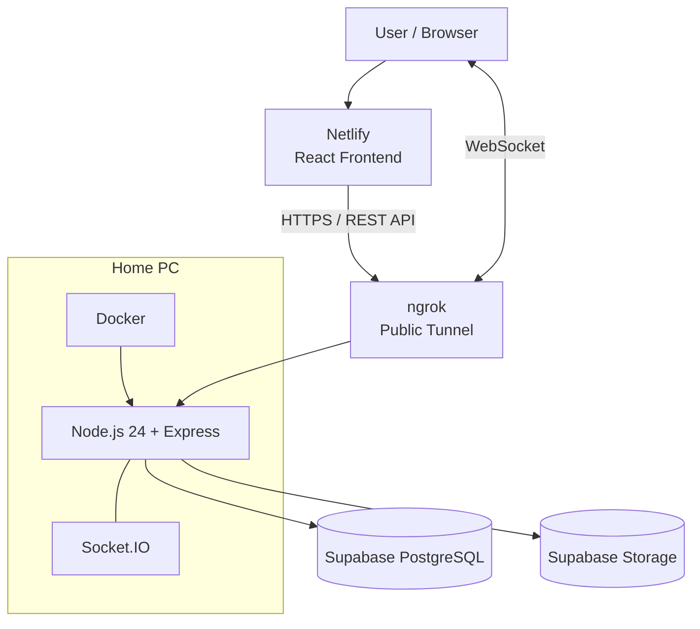

# Deployment Guide

## 1. Overview

LaporRuta menggunakan arsitektur deployment yang memisahkan frontend, backend, database, dan object storage.

Pada deployment untuk submission, frontend di-host menggunakan Netlify, sedangkan backend dijalankan menggunakan Docker pada PC lokal yang berfungsi sebagai application server.

Karena backend berjalan pada jaringan lokal, ngrok digunakan sebagai secure public tunnel agar frontend yang berada di Netlify dapat mengakses backend melalui internet.

Database PostgreSQL dan object storage menggunakan Supabase.

### Deployment Architecture

