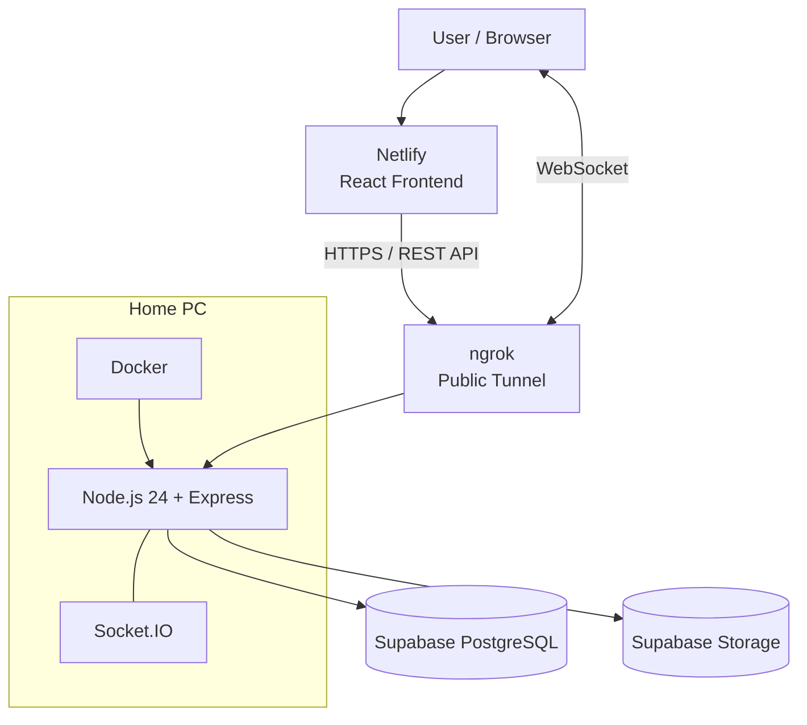
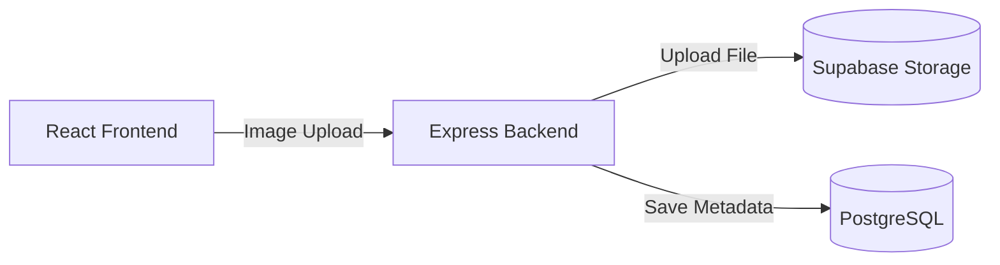
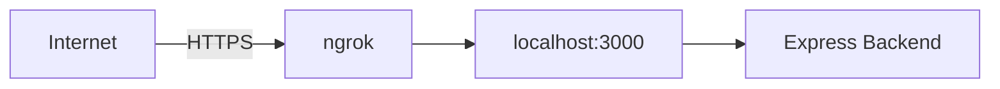
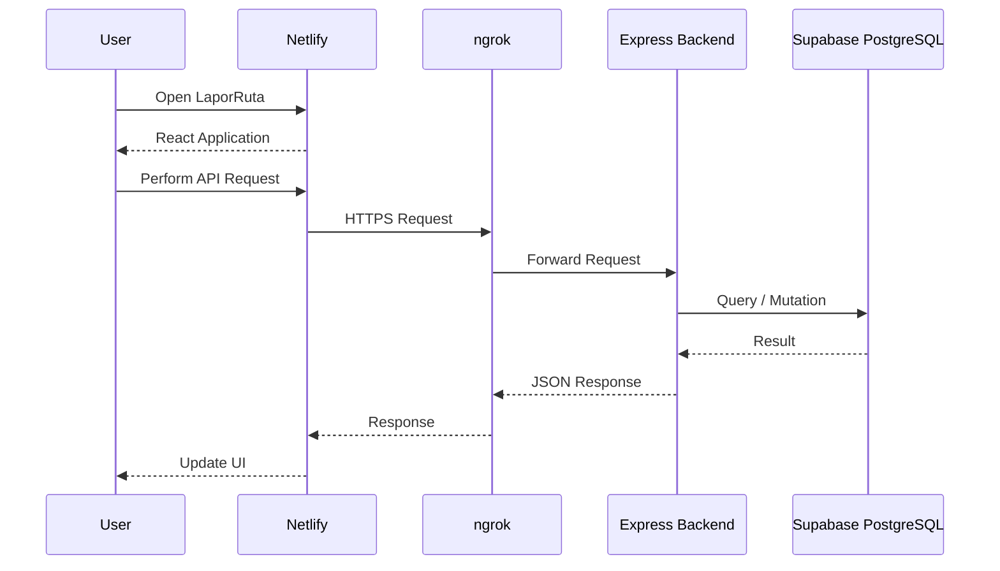
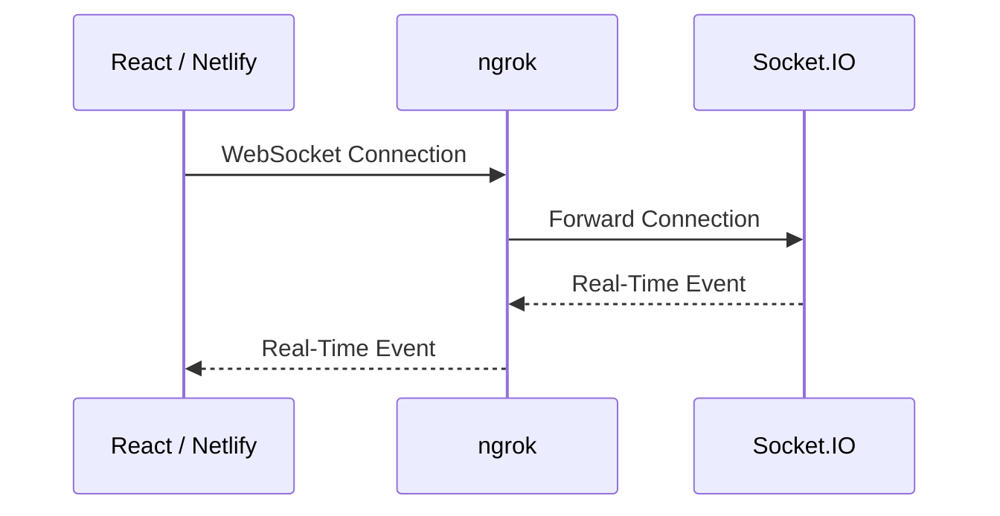
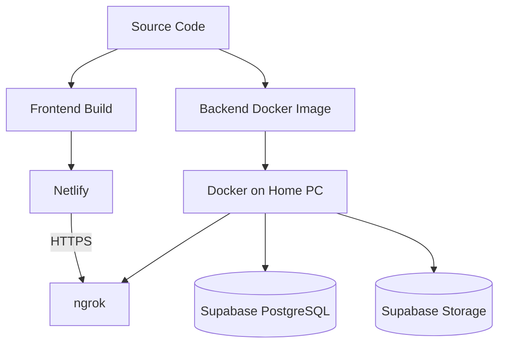

# Deployment Guide

## 1. Overview

LaporRuta menggunakan arsitektur deployment yang memisahkan frontend, backend, database, dan object storage.

Pada deployment untuk submission, frontend di-host menggunakan Netlify, sedangkan backend dijalankan menggunakan Docker pada PC lokal yang berfungsi sebagai application server.

Karena backend berjalan pada jaringan lokal, ngrok digunakan sebagai secure public tunnel agar frontend yang berada di Netlify dapat mengakses backend melalui internet.

Database PostgreSQL dan object storage menggunakan Supabase.

### Deployment Architecture



---

# 2. Deployment Components

| Component        | Platform / Technology | Responsibility                   |
| ---------------- | --------------------- | -------------------------------- |
| Frontend         | Netlify               | Hosting React web application    |
| Backend Runtime  | Node.js 24            | Running Express application      |
| Containerization | Docker                | Packaging and running backend    |
| Public Tunnel    | ngrok                 | Exposing backend to the internet |
| Database         | Supabase PostgreSQL   | Persistent relational data       |
| File Storage     | Supabase Storage      | Storing report images            |
| Real-Time        | Socket.IO             | Real-time communication          |

---

# 3. Prerequisites

Sebelum melakukan deployment, pastikan environment memiliki:

### Local Development / Build

- Node.js 24
- npm
- Git

### Backend Deployment

- Docker
- Docker Compose apabila digunakan
- ngrok

### Cloud Services

- Supabase project
- Netlify project
- ngrok account

---

# 4. Environment Variables

Environment variables digunakan untuk menyimpan configuration dan secret yang diperlukan aplikasi.

## 4.1 Backend

Backend membutuhkan konfigurasi untuk:

- Application server.
- PostgreSQL connection.
- JWT authentication.
- Refresh token.
- Supabase Storage.
- CORS.
- Environment mode.

Contoh struktur:

```env
NODE_ENV=production
PORT=3000

DATABASE_URL=<SUPABASE_POSTGRES_CONNECTION_STRING>

JWT_ACCESS_SECRET=<ACCESS_TOKEN_SECRET>
JWT_REFRESH_SECRET=<REFRESH_TOKEN_SECRET>

SUPABASE_URL=<SUPABASE_PROJECT_URL>
SUPABASE_SERVICE_ROLE_KEY=<SUPABASE_SERVICE_ROLE_KEY>

CORS_ORIGIN=<NETLIFY_FRONTEND_URL>
```

> Nama environment variable harus mengikuti konfigurasi aktual pada backend. Nilai secret tidak boleh dimasukkan ke repository.

---

## 4.2 Frontend

Frontend membutuhkan URL backend production.

Contoh:

```env
VITE_API_URL=https://<ngrok-domain>/api/v1
```

Jika aplikasi menggunakan environment variable tambahan, variable tersebut harus dikonfigurasi pada Netlify.

---

# 5. Supabase Setup

Supabase digunakan untuk dua kebutuhan utama:

1. PostgreSQL database.
2. Object storage.

## 5.1 PostgreSQL

Backend menggunakan PostgreSQL yang disediakan oleh Supabase.

Database digunakan untuk menyimpan:

- Users.
- Refresh tokens.
- Wilayah.
- Categories.
- Reports.
- Report images metadata.
- Upvotes.
- Comments.
- Admin notes.
- Activity logs.
- Invitations.
- Disputes.

Connection string PostgreSQL disimpan pada backend sebagai environment variable.

```env
DATABASE_URL=<SUPABASE_POSTGRES_CONNECTION_STRING>
```

Database credentials tidak disimpan pada source code.

---

# 6. Supabase Storage

Supabase Storage digunakan untuk menyimpan file gambar laporan.

Arsitektur penyimpanan:



File gambar disimpan pada Supabase Storage, sedangkan PostgreSQL menyimpan metadata seperti:

- `image_url`
- `file_path`
- `report_id`
- `is_after`

Backend bertindak sebagai layer yang mengatur proses upload.

---

# 7. Database Initialization

Sebelum menjalankan backend production, database harus sudah memiliki schema LaporRuta.

Urutan setup:

```text
Supabase Project
       │
       ▼
PostgreSQL Database
       │
       ▼
Create Database Schema
       │
       ▼
Insert Required Master Data
       │
       ▼
Backend Connection
```

Pastikan master data yang dibutuhkan aplikasi telah tersedia, terutama:

- Wilayah.
- Categories.

---

# 8. Backend Deployment

Backend berada pada repository:

```text
laporruta-backend/
```

Struktur backend:

```text
laporruta-backend/
├── src/
│   ├── config/
│   ├── constants/
│   ├── controllers/
│   ├── middlewares/
│   ├── models/
│   ├── routes/
│   ├── services/
│   ├── utils/
│   └── app.js
│
├── Dockerfile
├── .dockerignore
├── index.js
├── package.json
└── package-lock.json
```

---

# 9. Docker Build

Docker digunakan untuk menjalankan backend dalam environment yang konsisten.

Contoh proses build:

```bash
cd laporruta-backend

docker build -t laporruta-backend .
```

Setelah image berhasil dibuat:

```bash
docker images
```

Pastikan image:

```text
laporruta-backend
```

tersedia.

---

# 10. Running Backend with Docker

Backend dapat dijalankan menggunakan Docker.

Contoh:

```bash
docker run -d \
  --name laporruta-backend \
  --env-file .env \
  -p 3000:3000 \
  laporruta-backend
```

Penjelasan:

| Option         | Fungsi                              |
| -------------- | ----------------------------------- |
| `-d`           | Menjalankan container di background |
| `--name`       | Memberikan nama container           |
| `--env-file`   | Memuat environment variables        |
| `-p 3000:3000` | Mapping port host ke container      |

Periksa container:

```bash
docker ps
```

Periksa log:

```bash
docker logs laporruta-backend
```

---

# 11. Backend Health Check

Setelah container berjalan, lakukan pengecekan terhadap backend.

Contoh:

```text
http://localhost:3000
```

atau endpoint health check apabila tersedia pada backend.

Tujuannya untuk memastikan:

- Container berjalan.
- Express server berhasil start.
- Database dapat diakses.
- Environment variables berhasil dimuat.

---

# 12. Exposing Backend with ngrok

Karena backend berjalan pada PC lokal, backend perlu diekspos ke internet agar frontend yang di-host pada Netlify dapat mengaksesnya.

ngrok digunakan sebagai public tunnel.

Contoh:

```bash
ngrok http 3000
```

ngrok kemudian memberikan public HTTPS URL, misalnya:

```text
https://<random-domain>.ngrok-free.app
```

URL tersebut menjadi public entry point menuju backend.



---

# 13. Frontend Deployment

Frontend LaporRuta di-deploy menggunakan Netlify.

Build frontend terlebih dahulu secara lokal untuk memastikan production build berhasil.

Contoh:

```bash
npm install
npm run build
```

Hasil build biasanya berada pada:

```text
dist/
```

Netlify kemudian digunakan untuk menjalankan deployment frontend.

---

# 14. Netlify Configuration

Frontend membutuhkan environment variable untuk mengetahui URL backend production.

Contoh:

```env
VITE_API_URL=https://<ngrok-domain>/api/v1
```

Environment variable tersebut dikonfigurasi melalui Netlify.

Setelah konfigurasi environment selesai, lakukan deployment ulang agar frontend menggunakan configuration terbaru.

---

# 15. Frontend → Backend Communication

Setelah deployment:



Frontend tidak melakukan koneksi langsung ke PostgreSQL.

Semua operasi database dilakukan melalui backend.

---

# 16. WebSocket / Socket.IO

LaporRuta menggunakan Socket.IO untuk kebutuhan real-time.

Karena frontend dan backend berada pada environment yang berbeda, public ngrok endpoint juga digunakan sebagai jalur komunikasi menuju backend.



Event real-time digunakan untuk kebutuhan seperti:

- Public report updates.
- Report status changes.
- Upvote updates.
- Admin report assignment.
- Zone reassignment.
- Admin dashboard updates.

---

# 17. CORS Configuration

Karena frontend dan backend berada pada origin yang berbeda, backend harus mengizinkan origin frontend.

Contoh:

```env
CORS_ORIGIN=https://<netlify-domain>
```

Backend harus dikonfigurasi agar request dari frontend production dapat diterima.

Pada deployment production, sebaiknya hanya origin yang diperlukan yang diizinkan.

---

# 18. Production Deployment Flow

Deployment LaporRuta secara keseluruhan:



---

# 19. Deployment Checklist

## Supabase

- [ ] Supabase project tersedia.
- [ ] PostgreSQL schema sudah dibuat.
- [ ] Master wilayah tersedia.
- [ ] Master categories tersedia.
- [ ] Supabase Storage sudah dikonfigurasi.
- [ ] Backend memiliki database connection string.
- [ ] Backend memiliki Supabase Storage credentials.

## Backend

- [ ] Node.js version sesuai dengan Node.js 24.
- [ ] `npm install` berhasil.
- [ ] Environment variables tersedia.
- [ ] Docker image berhasil dibuat.
- [ ] Docker container berhasil dijalankan.
- [ ] Backend dapat terhubung ke PostgreSQL.
- [ ] Backend dapat melakukan upload ke Supabase Storage.
- [ ] API dapat diakses melalui localhost.
- [ ] Socket.IO dapat dijalankan.

## ngrok

- [ ] ngrok terinstall.
- [ ] Backend berjalan pada local port.
- [ ] ngrok tunnel aktif.
- [ ] Public HTTPS URL tersedia.
- [ ] URL backend production sudah diketahui.

## Frontend

- [ ] Environment variable backend sudah dikonfigurasi.
- [ ] Production build berhasil.
- [ ] Frontend berhasil di-deploy ke Netlify.
- [ ] Frontend dapat mengakses REST API.
- [ ] WebSocket connection berhasil.
- [ ] Authentication dapat digunakan pada production.

---

# 20. Deployment Verification

Setelah semua komponen aktif, lakukan verifikasi dari sisi user.

### Authentication

```text
Register
   ↓
Login
   ↓
Access Token
   ↓
Protected API
```

Pastikan:

- Register berhasil.
- Login berhasil.
- Protected endpoint dapat diakses.
- Refresh token dapat digunakan.
- Logout berhasil.

### Reporting

```text
Create Report
      ↓
Upload Image
      ↓
Report Created
      ↓
Moderation
      ↓
Verified
      ↓
Public Map
```

Pastikan:

- User dapat membuat laporan.
- Gambar berhasil tersimpan.
- Report tersimpan pada database.
- Assignment berhasil dilakukan.
- Admin dapat memproses laporan.
- Laporan terverifikasi muncul pada public map.

### Real-Time

Pastikan perubahan berikut dapat diterima tanpa refresh manual:

- New public report.
- Status change.
- Upvote change.
- Assignment.
- Reassignment.
- Admin dashboard update.

---

# 21. Troubleshooting

## Backend Container Tidak Berjalan

Periksa container:

```bash
docker ps -a
```

Periksa log:

```bash
docker logs laporruta-backend
```

Jika container berhenti, periksa:

- Environment variables.
- Database connection.
- Port configuration.
- Node.js application error.

---

## Database Connection Error

Periksa:

```env
DATABASE_URL=<correct_connection_string>
```

Kemudian pastikan:

- Supabase project aktif.
- PostgreSQL dapat diakses.
- Connection string benar.
- SSL configuration sesuai dengan koneksi PostgreSQL yang digunakan.

---

## Frontend Tidak Dapat Mengakses Backend

Periksa:

```env
VITE_API_URL=https://<ngrok-domain>/api/v1
```

Kemudian pastikan:

1. Docker container berjalan.
2. Backend dapat diakses melalui localhost.
3. ngrok tunnel aktif.
4. Public ngrok URL benar.
5. CORS mengizinkan origin Netlify.
6. Frontend sudah di-build ulang setelah environment variable berubah.

---

## ngrok URL Berubah

Pada konfigurasi ngrok yang menggunakan temporary public URL, URL dapat berubah ketika tunnel dibuat ulang.

Jika URL berubah:

```text
ngrok URL
     ↓
Update Frontend Environment Variable
     ↓
Deploy Frontend Again
```

Environment variable frontend harus diperbarui agar menunjuk ke URL backend yang aktif.

---

## Image Upload Gagal

Periksa:

- Supabase Storage configuration.
- Storage credentials.
- File size.
- MIME type.
- Backend upload configuration.
- Network connection.
- Storage path.

Pastikan file tidak disimpan langsung pada container sebagai persistent storage.

---

# 22. Security Considerations

Deployment production harus memperhatikan keamanan credential dan endpoint.

### Secrets

Jangan commit:

```text
.env
```

ke repository.

Contoh `.gitignore`:

```gitignore
.env
.env.*
!.env.example
```

### Credentials

Credential berikut harus diperlakukan sebagai secret:

- Database credentials.
- JWT secrets.
- Supabase service role key.
- API credentials.

### Frontend Environment

Jangan menempatkan secret backend pada environment variable frontend.

Variable seperti:

```text
VITE_*
```

pada frontend dapat terekspos kepada browser.

Frontend hanya boleh menerima configuration yang memang aman untuk client.

---

# 23. Current Submission Deployment

Deployment yang digunakan untuk submission LaporRuta:

```text
                    INTERNET
                        │
                        ▼
              ┌─────────────────┐
              │     Netlify     │
              │ React Frontend  │
              └────────┬────────┘
                       │
                       │ HTTPS
                       ▼
              ┌─────────────────┐
              │      ngrok      │
              │  Public Tunnel  │
              └────────┬────────┘
                       │
                       ▼
              ┌─────────────────┐
              │     Docker      │
              │   Home PC       │
              │                 │
              │ Node.js 24      │
              │ Express         │
              │ Socket.IO       │
              └───────┬─────────┘
                      │
             ┌────────┴────────┐
             ▼                 ▼
      ┌──────────────┐  ┌──────────────┐
      │   Supabase   │  │   Supabase   │
      │  PostgreSQL  │  │    Storage   │
      └──────────────┘  └──────────────┘
```

---

# 24. Limitations of Current Deployment

Deployment saat ini menggunakan PC lokal sebagai host backend dan ngrok sebagai public tunnel.

Konsekuensinya:

- Backend bergantung pada availability PC host.
- Backend tidak tersedia apabila PC mati atau koneksi internet terputus.
- Public endpoint dapat berubah apabila menggunakan temporary ngrok URL.
- Kapasitas backend bergantung pada resource PC.
- Deployment belum menggunakan dedicated cloud server.

Arsitektur ini digunakan untuk kebutuhan development, demonstration, dan competition submission.

Untuk production deployment berskala lebih besar, backend dapat dipindahkan ke dedicated server atau cloud infrastructure.

---

# 25. Future Deployment Improvements

Beberapa peningkatan deployment yang dapat dilakukan:

- Dedicated cloud server untuk backend.
- Managed container deployment.
- Stable domain untuk backend.
- HTTPS dengan custom domain.
- CI/CD pipeline.
- Automated Docker image deployment.
- Centralized logging.
- Monitoring dan alerting.
- Horizontal scaling.
- Load balancing.
- Backup dan disaster recovery strategy.

---

# 26. Deployment Summary

LaporRuta menggunakan deployment architecture yang memisahkan application layer dan managed infrastructure.

```text
Frontend
    │
    └── Netlify
          │
          │ HTTPS
          ▼
       ngrok
          │
          ▼
Backend
    │
    └── Docker
          │
          ├── Node.js 24
          ├── Express
          └── Socket.IO
                │
                ├── Supabase PostgreSQL
                └── Supabase Storage
```

Arsitektur tersebut memungkinkan frontend yang di-host secara public pada Netlify berkomunikasi dengan backend yang berjalan pada PC melalui public ngrok tunnel, sementara persistent data dan file storage dikelola menggunakan layanan Supabase.
